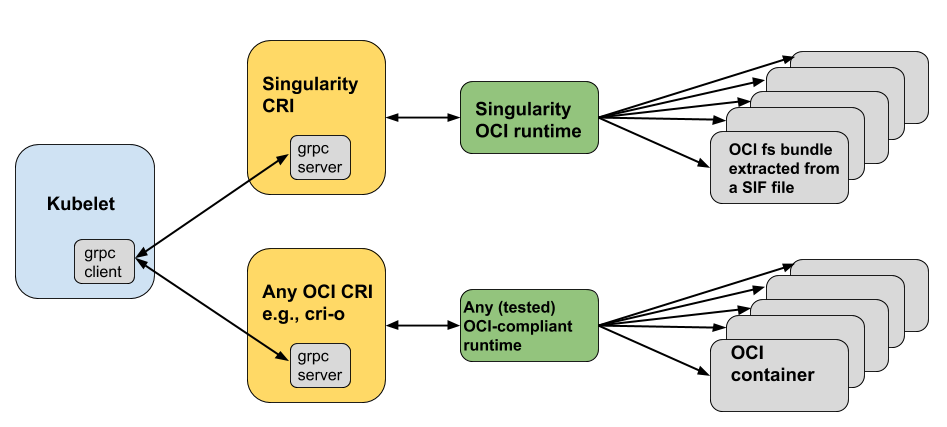

.. _oci_runtime:

.. TODO-MUST something with the long json snippet ... 

===================
OCI Runtime Support 
===================

.. _sec:oci_runtime_overview:

--------
Overview
--------

OCI is an acronym for the `Open Containers Initiative <https://www.opencontainers.org/>`_ - an independent organization whose mandate is to develop open standards relating to containerization. To date, standardization efforts have focused on container formats and runtimes. {Singularity}'s compliance with respect to the OCI Image Specification is considered in detail :ref:`elsewhere <sec:oci_overview>`. It is {Singularity}'s compliance with the OCI Runtime Specification that is of concern here. 

Briefly, compliance with respect to the OCI Runtime Specification is addressed in {Singularity} through the introduction of the ``oci`` command group. Although this command group can, in principle, be used to provide a runtime that supports end users, in this initial documentation effort, emphasis is placed upon interoperability with Kubernetes; more specifically, interoperability with Kubernetes via the `{Singularity} Container Runtime Interface <https://www.sylabs.io/guides/cri/1.0/user-guide/index.html>`_. 

Owing to this restricted focus, a subset of the {Singularity} ``oci`` command group receives attention here; specifically:

	- Mounting and unmounting OCI filesystem bundles
	- Creating OCI compliant container instances 

Some context for integration with Kubernetes via the {Singularity} CRI is provided at the end of the section.

.. note:: 

	All commands in the ``oci`` command group require ``root`` privileges. 

.. TODO All commands require root access ... 

.. TODO Need to account for the diff bootstrap agents that could produce a SIF file for OCI runtime support ... 

.. TODO Compliance testing/validation  - need to document ... https://github.com/opencontainers/runtime-tools

------------------------------
Mounted OCI Filesystem Bundles
------------------------------

Mounting an OCI Filesystem Bundle
=================================

`BusyBox <https://busybox.net/about.html>`_ is used here for the purpose of illustration.

Suppose the Singularity Image Format (SIF) file ``busybox_latest.sif`` exists locally. (Recall: 

.. code-block:: none

	$ singularity pull docker://busybox
	INFO:    Starting build...
	Getting image source signatures
	Copying blob sha256:fc1a6b909f82ce4b72204198d49de3aaf757b3ab2bb823cb6e47c416b97c5985
	 738.13 KiB / 738.13 KiB [==================================================] 0s
	Copying config sha256:5fffaf1f2c1830a6a8cf90eb27c7a1a8476b8c49b4b6261a20d6257d031ce4f3
	 575 B / 575 B [============================================================] 0s
	Writing manifest to image destination
	Storing signatures
	INFO:    Creating SIF file...
	INFO:    Build complete: busybox_latest.sif

This is one way to bootstrap creation of this image in SIF that *retains* a local copy - i.e., a local copy of the SIF file *and* a cached copy of the OCI blobs. Additional approaches and details can be found in the section :ref:`Support for Docker and OCI <singularity-and-docker>`). 

For the purpose of boostrapping the creation of an OCI compliant container, this SIF file can be mounted as follows: 

.. code-block:: none 

	$ sudo singularity oci mount ./busybox_latest.sif /var/tmp/busybox

By issuing the ``mount`` command, the root filesystem encapsulated in the SIF file ``busybox_latest.sif`` is mounted on ``/var/tmp/busybox`` as an ``overlay`` file system, 

.. code-block:: none

	$ sudo df -k
	Filesystem                   1K-blocks    Used Available Use% Mounted on
	udev                            475192       0    475192   0% /dev
	tmpfs                           100916    1604     99312   2% /run
	/dev/mapper/vagrant--vg-root  19519312 2620740  15883996  15% /
	tmpfs                           504560       0    504560   0% /dev/shm
	tmpfs                             5120       0      5120   0% /run/lock
	tmpfs                           504560       0    504560   0% /sys/fs/cgroup
	tmpfs                           100912       0    100912   0% /run/user/900
	overlay                       19519312 2620740  15883996  15% /var/tmp/busybox/rootfs

with permissions as follows:

.. code-block:: none

	$ sudo ls -ld /var/tmp/busybox
	drwx------ 4 root root 4096 Apr  4 14:30 /var/tmp/busybox

Content of an OCI Compliant Filesystem Bundle
=============================================

The *expected* contents of the mounted filesystem are as follows:

.. code-block:: none 

	$ sudo ls -la /var/tmp/busybox
	total 28
	drwx------ 4 root root 4096 Apr  4 14:30 .
	drwxrwxrwt 4 root root 4096 Apr  4 14:30 ..
	-rw-rw-rw- 1 root root 9879 Apr  4 14:30 config.json
	drwx------ 4 root root 4096 Apr  4 14:30 overlay
	drwx------ 1 root root 4096 Apr  4 14:30 rootfs

From the perspective of the `OCI runtime specification <https://github.com/opencontainers/runtime-spec/blob/master/bundle.md>`_, this content is expected because it prescribes a 

	"... a format for encoding a container as a **filesystem bundle** - a set of files organized in a certain way, and containing all the necessary data and metadata for any compliant runtime to perform all standard operations against it." 

Critical to compliance with the specification is the presence of the following *mandatory* artifacts residing locally in a single directory:

	1. The ``config.json`` file - a file of configuration data that must reside in the root of the bundle directory under this name 

	2. The container's root filesystem - a referenced directory

.. note::

	Because the directory itself, i.e., ``/var/tmp/busybox`` is *not* part of the bundle, the mount point can be chosen arbitrarily. 

The `filtered <https://github.com/stedolan/jq>`_ ``config.json`` file corresponding to the OCI mounted ``busybox_latest.sif`` container can be detailed as follows via ``$ sudo cat /var/tmp/busybox/config.json | jq``: 

.. code-block:: json 

	{
	  "ociVersion": "1.0.1-dev",
	  "process": {
	    "user": {
	      "uid": 0,
	      "gid": 0
	    },
	    "args": [
	      "/.singularity.d/actions/run"
	    ],
	    "env": [
	      "PATH=/usr/local/sbin:/usr/local/bin:/usr/sbin:/usr/bin:/sbin:/bin",
	      "TERM=xterm"
	    ],
	    "cwd": "/",
	    "capabilities": {
	      "bounding": [
	        "CAP_CHOWN",
	        "CAP_DAC_OVERRIDE",
	        "CAP_FSETID",
	        "CAP_FOWNER",
	        "CAP_MKNOD",
	        "CAP_NET_RAW",
	        "CAP_SETGID",
	        "CAP_SETUID",
	        "CAP_SETFCAP",
	        "CAP_SETPCAP",
	        "CAP_NET_BIND_SERVICE",
	        "CAP_SYS_CHROOT",
	        "CAP_KILL",
	        "CAP_AUDIT_WRITE"
	      ],
	      "effective": [
	        "CAP_CHOWN",
	        "CAP_DAC_OVERRIDE",
	        "CAP_FSETID",
	        "CAP_FOWNER",
	        "CAP_MKNOD",
	        "CAP_NET_RAW",
	        "CAP_SETGID",
	        "CAP_SETUID",
	        "CAP_SETFCAP",
	        "CAP_SETPCAP",
	        "CAP_NET_BIND_SERVICE",
	        "CAP_SYS_CHROOT",
	        "CAP_KILL",
	        "CAP_AUDIT_WRITE"
	      ],
	      "inheritable": [
	        "CAP_CHOWN",
	        "CAP_DAC_OVERRIDE",
	        "CAP_FSETID",
	        "CAP_FOWNER",
	        "CAP_MKNOD",
	        "CAP_NET_RAW",
	        "CAP_SETGID",
	        "CAP_SETUID",
	        "CAP_SETFCAP",
	        "CAP_SETPCAP",
	        "CAP_NET_BIND_SERVICE",
	        "CAP_SYS_CHROOT",
	        "CAP_KILL",
	        "CAP_AUDIT_WRITE"
	      ],
	      "permitted": [
	        "CAP_CHOWN",
	        "CAP_DAC_OVERRIDE",
	        "CAP_FSETID",
	        "CAP_FOWNER",
	        "CAP_MKNOD",
	        "CAP_NET_RAW",
	        "CAP_SETGID",
	        "CAP_SETUID",
	        "CAP_SETFCAP",
	        "CAP_SETPCAP",
	        "CAP_NET_BIND_SERVICE",
	        "CAP_SYS_CHROOT",
	        "CAP_KILL",
	        "CAP_AUDIT_WRITE"
	      ],
	      "ambient": [
	        "CAP_CHOWN",
	        "CAP_DAC_OVERRIDE",
	        "CAP_FSETID",
	        "CAP_FOWNER",
	        "CAP_MKNOD",
	        "CAP_NET_RAW",
	        "CAP_SETGID",
	        "CAP_SETUID",
	        "CAP_SETFCAP",
	        "CAP_SETPCAP",
	        "CAP_NET_BIND_SERVICE",
	        "CAP_SYS_CHROOT",
	        "CAP_KILL",
	        "CAP_AUDIT_WRITE"
	      ]
	    },
	    "rlimits": [
	      {
	        "type": "RLIMIT_NOFILE",
	        "hard": 1024,
	        "soft": 1024
	      }
	    ]
	  },
	  "root": {
	    "path": "/var/tmp/busybox/rootfs"
	  },
	  "hostname": "mrsdalloway",
	  "mounts": [
	    {
	      "destination": "/proc",
	      "type": "proc",
	      "source": "proc"
	    },
	    {
	      "destination": "/dev",
	      "type": "tmpfs",
	      "source": "tmpfs",
	      "options": [
	        "nosuid",
	        "strictatime",
	        "mode=755",
	        "size=65536k"
	      ]
	    },
	    {
	      "destination": "/dev/pts",
	      "type": "devpts",
	      "source": "devpts",
	      "options": [
	        "nosuid",
	        "noexec",
	        "newinstance",
	        "ptmxmode=0666",
	        "mode=0620",
	        "gid=5"
	      ]
	    },
	    {
	      "destination": "/dev/shm",
	      "type": "tmpfs",
	      "source": "shm",
	      "options": [
	        "nosuid",
	        "noexec",
	        "nodev",
	        "mode=1777",
	        "size=65536k"
	      ]
	    },
	    {
	      "destination": "/dev/mqueue",
	      "type": "mqueue",
	      "source": "mqueue",
	      "options": [
	        "nosuid",
	        "noexec",
	        "nodev"
	      ]
	    },
	    {
	      "destination": "/sys",
	      "type": "sysfs",
	      "source": "sysfs",
	      "options": [
	        "nosuid",
	        "noexec",
	        "nodev",
	        "ro"
	      ]
	    }
	  ],
	  "linux": {
	    "resources": {
	      "devices": [
	        {
	          "allow": false,
	          "access": "rwm"
	        }
	      ]
	    },
	    "namespaces": [
	      {
	        "type": "pid"
	      },
	      {
	        "type": "network"
	      },
	      {
	        "type": "ipc"
	      },
	      {
	        "type": "uts"
	      },
	      {
	        "type": "mount"
	      }
	    ],
	    "seccomp": {
	      "defaultAction": "SCMP_ACT_ERRNO",
	      "architectures": [
	        "SCMP_ARCH_X86_64",
	        "SCMP_ARCH_X86",
	        "SCMP_ARCH_X32"
	      ],
	      "syscalls": [
	        {
	          "names": [
	            "accept",
	            "accept4",
	            "access",
	            "alarm",
	            "bind",
	            "brk",
	            "capget",
	            "capset",
	            "chdir",
	            "chmod",
	            "chown",
	            "chown32",
	            "clock_getres",
	            "clock_gettime",
	            "clock_nanosleep",
	            "close",
	            "connect",
	            "copy_file_range",
	            "creat",
	            "dup",
	            "dup2",
	            "dup3",
	            "epoll_create",
	            "epoll_create1",
	            "epoll_ctl",
	            "epoll_ctl_old",
	            "epoll_pwait",
	            "epoll_wait",
	            "epoll_wait_old",
	            "eventfd",
	            "eventfd2",
	            "execve",
	            "execveat",
	            "exit",
	            "exit_group",
	            "faccessat",
	            "fadvise64",
	            "fadvise64_64",
	            "fallocate",
	            "fanotify_mark",
	            "fchdir",
	            "fchmod",
	            "fchmodat",
	            "fchown",
	            "fchown32",
	            "fchownat",
	            "fcntl",
	            "fcntl64",
	            "fdatasync",
	            "fgetxattr",
	            "flistxattr",
	            "flock",
	            "fork",
	            "fremovexattr",
	            "fsetxattr",
	            "fstat",
	            "fstat64",
	            "fstatat64",
	            "fstatfs",
	            "fstatfs64",
	            "fsync",
	            "ftruncate",
	            "ftruncate64",
	            "futex",
	            "futimesat",
	            "getcpu",
	            "getcwd",
	            "getdents",
	            "getdents64",
	            "getegid",
	            "getegid32",
	            "geteuid",
	            "geteuid32",
	            "getgid",
	            "getgid32",
	            "getgroups",
	            "getgroups32",
	            "getitimer",
	            "getpeername",
	            "getpgid",
	            "getpgrp",
	            "getpid",
	            "getppid",
	            "getpriority",
	            "getrandom",
	            "getresgid",
	            "getresgid32",
	            "getresuid",
	            "getresuid32",
	            "getrlimit",
	            "get_robust_list",
	            "getrusage",
	            "getsid",
	            "getsockname",
	            "getsockopt",
	            "get_thread_area",
	            "gettid",
	            "gettimeofday",
	            "getuid",
	            "getuid32",
	            "getxattr",
	            "inotify_add_watch",
	            "inotify_init",
	            "inotify_init1",
	            "inotify_rm_watch",
	            "io_cancel",
	            "ioctl",
	            "io_destroy",
	            "io_getevents",
	            "ioprio_get",
	            "ioprio_set",
	            "io_setup",
	            "io_submit",
	            "ipc",
	            "kill",
	            "lchown",
	            "lchown32",
	            "lgetxattr",
	            "link",
	            "linkat",
	            "listen",
	            "listxattr",
	            "llistxattr",
	            "_llseek",
	            "lremovexattr",
	            "lseek",
	            "lsetxattr",
	            "lstat",
	            "lstat64",
	            "madvise",
	            "memfd_create",
	            "mincore",
	            "mkdir",
	            "mkdirat",
	            "mknod",
	            "mknodat",
	            "mlock",
	            "mlock2",
	            "mlockall",
	            "mmap",
	            "mmap2",
	            "mprotect",
	            "mq_getsetattr",
	            "mq_notify",
	            "mq_open",
	            "mq_timedreceive",
	            "mq_timedsend",
	            "mq_unlink",
	            "mremap",
	            "msgctl",
	            "msgget",
	            "msgrcv",
	            "msgsnd",
	            "msync",
	            "munlock",
	            "munlockall",
	            "munmap",
	            "nanosleep",
	            "newfstatat",
	            "_newselect",
	            "open",
	            "openat",
	            "pause",
	            "pipe",
	            "pipe2",
	            "poll",
	            "ppoll",
	            "prctl",
	            "pread64",
	            "preadv",
	            "prlimit64",
	            "pselect6",
	            "pwrite64",
	            "pwritev",
	            "read",
	            "readahead",
	            "readlink",
	            "readlinkat",
	            "readv",
	            "recv",
	            "recvfrom",
	            "recvmmsg",
	            "recvmsg",
	            "remap_file_pages",
	            "removexattr",
	            "rename",
	            "renameat",
	            "renameat2",
	            "restart_syscall",
	            "rmdir",
	            "rt_sigaction",
	            "rt_sigpending",
	            "rt_sigprocmask",
	            "rt_sigqueueinfo",
	            "rt_sigreturn",
	            "rt_sigsuspend",
	            "rt_sigtimedwait",
	            "rt_tgsigqueueinfo",
	            "sched_getaffinity",
	            "sched_getattr",
	            "sched_getparam",
	            "sched_get_priority_max",
	            "sched_get_priority_min",
	            "sched_getscheduler",
	            "sched_rr_get_interval",
	            "sched_setaffinity",
	            "sched_setattr",
	            "sched_setparam",
	            "sched_setscheduler",
	            "sched_yield",
	            "seccomp",
	            "select",
	            "semctl",
	            "semget",
	            "semop",
	            "semtimedop",
	            "send",
	            "sendfile",
	            "sendfile64",
	            "sendmmsg",
	            "sendmsg",
	            "sendto",
	            "setfsgid",
	            "setfsgid32",
	            "setfsuid",
	            "setfsuid32",
	            "setgid",
	            "setgid32",
	            "setgroups",
	            "setgroups32",
	            "setitimer",
	            "setpgid",
	            "setpriority",
	            "setregid",
	            "setregid32",
	            "setresgid",
	            "setresgid32",
	            "setresuid",
	            "setresuid32",
	            "setreuid",
	            "setreuid32",
	            "setrlimit",
	            "set_robust_list",
	            "setsid",
	            "setsockopt",
	            "set_thread_area",
	            "set_tid_address",
	            "setuid",
	            "setuid32",
	            "setxattr",
	            "shmat",
	            "shmctl",
	            "shmdt",
	            "shmget",
	            "shutdown",
	            "sigaltstack",
	            "signalfd",
	            "signalfd4",
	            "sigreturn",
	            "socket",
	            "socketcall",
	            "socketpair",
	            "splice",
	            "stat",
	            "stat64",
	            "statfs",
	            "statfs64",
	            "symlink",
	            "symlinkat",
	            "sync",
	            "sync_file_range",
	            "syncfs",
	            "sysinfo",
	            "syslog",
	            "tee",
	            "tgkill",
	            "time",
	            "timer_create",
	            "timer_delete",
	            "timerfd_create",
	            "timerfd_gettime",
	            "timerfd_settime",
	            "timer_getoverrun",
	            "timer_gettime",
	            "timer_settime",
	            "times",
	            "tkill",
	            "truncate",
	            "truncate64",
	            "ugetrlimit",
	            "umask",
	            "uname",
	            "unlink",
	            "unlinkat",
	            "utime",
	            "utimensat",
	            "utimes",
	            "vfork",
	            "vmsplice",
	            "wait4",
	            "waitid",
	            "waitpid",
	            "write",
	            "writev"
	          ],
	          "action": "SCMP_ACT_ALLOW"
	        },
	        {
	          "names": [
	            "personality"
	          ],
	          "action": "SCMP_ACT_ALLOW",
	          "args": [
	            {
	              "index": 0,
	              "value": 0,
	              "op": "SCMP_CMP_EQ"
	            },
	            {
	              "index": 0,
	              "value": 8,
	              "op": "SCMP_CMP_EQ"
	            },
	            {
	              "index": 0,
	              "value": 4294967295,
	              "op": "SCMP_CMP_EQ"
	            }
	          ]
	        },
	        {
	          "names": [
	            "chroot"
	          ],
	          "action": "SCMP_ACT_ALLOW"
	        },
	        {
	          "names": [
	            "clone"
	          ],
	          "action": "SCMP_ACT_ALLOW",
	          "args": [
	            {
	              "index": 0,
	              "value": 2080505856,
	              "op": "SCMP_CMP_MASKED_EQ"
	            }
	          ]
	        },
	        {
	          "names": [
	            "arch_prctl"
	          ],
	          "action": "SCMP_ACT_ALLOW"
	        },
	        {
	          "names": [
	            "modify_ldt"
	          ],
	          "action": "SCMP_ACT_ALLOW"
	        }
	      ]
	    }
	  }
	}

Furthermore, and through use of ``$ sudo cat /var/tmp/busybox/config.json | jq [.root.path]``, the property

.. code-block:: json

	[
  		"/var/tmp/busybox/rootfs"
	]

identifies ``/var/tmp/busybox/rootfs`` as the container's root filesystem, as required by the standard; this filesystem has contents:

.. code-block:: none

	$ sudo ls /var/tmp/busybox/rootfs
	bin  dev  environment  etc  home  proc	root  singularity  sys	tmp  usr  var

.. note::

	``environment`` and ``singularity`` above are symbolic links to the ``.singularity.d`` directory. 

.. TODO Is the ``.singularity.d`` ignored in this case? Relates to the other quote I lifted ... 

	"The definition of a bundle is only concerned with how a container, and its configuration data, are stored on a local filesystem so that it can be consumed by a compliant runtime."

Beyond ``root.path``, the ``config.json`` file includes a multitude of additional properties - for example:

	- ``ociVersion`` - a mandatory property that identifies the version of the OCI runtime specification that the bundle is compliant with 

	- ``process`` - an optional property that specifies the container process. When invoked via {Singularity}, subproperties such as ``args`` are populated by making use of the contents of the ``.singularity.d`` directory, e.g. via ``$ sudo cat /var/tmp/busybox/config.json | jq [.process.args]``:

	.. code-block:: json

		[
		  [
		    "/.singularity.d/actions/run"
		  ]
		]

	where ``run`` equates to the :ref:`familiar runscript <sec:inspect_container_metadata>` for this container. If image creation is bootstrapped via a Docker or OCI agent, {Singularity} will make use of ``ENTRYPOINT`` or ``CMD`` (from the OCI image) to populate ``args``; for additional discussion, please refer to :ref:`Directing Execution <sec:def_files_execution>` in the section :ref:`Support for Docker and OCI <singularity-and-docker>`. 

For a comprehensive discussion of all the ``config.json`` file properties, refer to the `implementation guide <https://github.com/opencontainers/runtime-spec/blob/master/config.md>`_. 

Technically, the ``overlay`` directory was *not* content expected of an OCI compliant filesystem bundle. As detailed in the section dedicated to `Persistent Overlays <persistent_overlays.html>`_, these directories allow for the introduction of 
a writable file system on an otherwise immutable read-only container; thus they permit the illusion of read-write access.

.. TODO Need to ensure that what's written above is correct 

.. note::

	SIF is stated to be an extensible format; by encapsulating a filesystem bundle that conforms with the OCI runtime specification, this extensibility is evident.

------------------------------------------
Creating OCI Compliant Container Instances 
------------------------------------------

SIF files encapsulate the OCI runtime. By 'OCI mounting' a SIF file (see above), this encapsulated runtime is revealed; please refer to the note below for additional details. Once revealed, the filesystem bundle can be used to bootstrap the creation of an OCI compliant container instance as follows: 

.. code-block:: none

	$ sudo singularity oci create -b /var/tmp/busybox busybox1

.. note::

	Data for the ``config.json`` file exists within the SIF file as a descriptor for images pulled or built from Docker/OCI registries. For images sourced elsewhere, a default ``config.json`` file is created when the ``singularity oci mount ...`` command is issued. 

	Upon invocation, ``singularity oci mount ...`` also mounts the root filesystem stored in the SIF file on ``/bundle/rootfs``, and establishes an overlay filesystem on the mount point ``/bundle/overlay``. 

In this example, the filesystem bundle is located in the directory ``/var/tmp/busybox`` - i.e., the mount point identified above with respect to 'OCI mounting'. The ``config.json`` file, along with the ``rootfs`` and ``overlay`` filesystems, are all employed in the bootstrap process. The instance is named ``busybox1`` in this example. 

.. note::

	The outcome of this creation request is truly a container **instance**. Multiple instances of the same container can easily be created by simply changing the name of the instance upon subsequent invocation requests. 

The ``state`` of the container instance can be determined via ``$ sudo singularity oci state busybox1``:

.. code-block:: json

	{
	"ociVersion": "1.0.1-dev",
	"id": "busybox1",
	"status": "created",
	"pid": 6578,
	"bundle": "/var/tmp/busybox",
	"createdAt": 1554389921452964253,
	"attachSocket": "/var/run/singularity/instances/root/busybox1/attach.sock",
	"controlSocket": "/var/run/singularity/instances/root/busybox1/control.sock"
	}

Container state, as conveyed via these properties, is in compliance with the OCI runtime specification as detailed `here <https://github.com/opencontainers/runtime-spec/blob/master/runtime.md#state>`_. 

The ``create`` command has a number of options available. Of these, real-time logging to a file is likely to be of particular value - e.g., in deployments where auditing requirements exist. 

.. TODO - illustrate use of cgroups 

.. ------------------------------------------
.. Starting OCI Compliant Container Instances 
.. ------------------------------------------

.. $ sudo singularity oci start busybox

.. ~$ sudo singularity oci state busybox

.. TODO Review CC's responses again ... see GDocs note on March 20, 2019

.. TODO Highlight UID & GID ??? 

.. TODO What is an overlay fs?  ^^^ https://www.datalight.com/blog/2016/01/27/explaining-overlayfs-%E2%80%93-what-it-does-and-how-it-works/ 
.. Check again after I create a bundle and container ... 

.. sandbox???

---------------------------------
Unmounting OCI Filesystem Bundles
---------------------------------

To unmount a mounted OCI filesystem bundle, the following command should be issued:

.. code-block:: none

	$ sudo singularity oci umount /var/tmp/busybox

.. note:: 

	The argument provided to ``oci umount`` above is the name of the bundle path, ``/var/tmp/busybox``, as opposed to the mount point for the overlay filesystem, ``/var/tmp/busybox/rootfs``. 

.. TODO Affect on running instances ... 

.. https://www.sylabs.io/guides/cri/1.0/user-guide/installation.html?highlight=oci#install-dependencies 

----------------------
Kubernetes Integration
----------------------

As noted at the :ref:`outset here <sec:oci_runtime_overview>`, in documenting support for an OCI runtime in {Singularity}, the impetus is initially derived from the requirement to integrate with `Kubernetes <https://kubernetes.io/>`_. Simply stated, Kubernetes is an open-source system for orchestrating containers; developed originally at Google, Kubernetes was contributed as seed technology to the `Cloud Native Compute Foundation <https://www.cncf.io/>`_ (CNCF). At this point, Kubernetes is regarded as a Graduated Project by CNCF, and is being used widely in production deployments. Even though Kubernetes emphasizes an orientation around services, it is appealing to those seeking to orchestrate containers having compute-driven requirements. Furthermore, emerging classes of workload in AI for example, appear to have requirements that are best addressed by a combination of service and traditional HPC infrastructures. Thus there is ample existing, as well as emerging, interest in integrating {Singularity} containers with Kubernetes. 

The connection with support for the OCI runtime documented here, within the context of a {Singularity}-Kubernetes integration, can be best established through an architectural schematic. Dating back to the introduction of a Container Runtime Interface (CRI) for Kubernetes in late 2016, the schematic below is a modified version of the original presented in `a Kubernetes blog post <https://kubernetes.io/blog/2016/12/container-runtime-interface-cri-in-kubernetes/>`_. The lower branch of this schematic is essentially a reproduction of the original; it does however, place emphasis on OCI compliance in terms of the CRI and containers (the runtime as well as their instances). 

From this schematic it is evident that integrating {Singularity} containers with Kubernetes requires the following efforts:

	1. Implementation of a CRI for {Singularity} 
	
	2. Implementation of an OCI runtime in {Singularity}

The implementation of a CRI for {Singularity} is the emphasis of a separate and distinct `open source project <https://github.com/sylabs/singularity-cri>`_; the implementation of this CRI is documented here. For the rationale conveyed through the architectural schematic, {Singularity} CRI's dependence upon {Singularity} with OCI runtime support is made clear as `an installation prerequisite <https://www.sylabs.io/guides/cri/1.0/user-guide/installation.html?highlight=oci#install-dependencies>`_. User-facing documentation for {Singularity} CRI details usage in a Kubernetes context - usage, of course, that involves orchestration of a {Singularity} container obtained from the `Sylabs Cloud Container Library <https://cloud.sylabs.io/library>`_. Because the entire Kubernetes-based deployment can exist within a single instance of a {Singularity} container, {Singularity} CRI can be easily evaluated via Sykube; inspired by `Minikube <https://kubernetes.io/docs/setup/minikube/>`_, `use of Sykube <https://www.sylabs.io/guides/cri/1.0/user-guide/sykube.html>`_ is included in the documentation for {Singularity} CRI.

Documenting the implementation of an OCI-compliant runtime for {Singularity} has been the emphasis here. Although this standalone runtime can be used by end users independent of anything to do with {Singularity} and Kubernetes, the primary purpose here has been documenting it within this integrated context. In other words, by making use of the OCI runtime presented by {Singularity}, commands originating from Kubernetes (see, e.g., `Basic Usage <https://sylabs.io/guides/cri/1.0/user-guide/examples.html>`_ in the {Singularity} CRI documentation) have impact ultimately on {Singularity} containers via the CRI. {Singularity} CRI is implemented as a `gRPC <https://grpc.io/>`_ server - i.e., a persistent service available to `Kubelets <https://kubernetes.io/docs/reference/command-line-tools-reference/kubelet/>`_ (node agents). Taken together, this integration allows {Singularity} containers to be manipulated directly from Kubernetes.  

.. TODO Describe a workflow 

.. ----------------------
.. Best Practices
.. ----------------------

.. TODO - BP - umount ??? 

.. CC's suggested workflow:

.. singularity build /tmp/test.sif docker://busybox
.. sudo singularity oci mount /tmp/test.sif /var/tmp/busy
.. sudo singularity oci create -b /var/tmp/busy testing > /dev/null 2>&1
.. sudo singularity oci start testing
.. sudo singularity oci exec testing /bin/sh
.. sudo singularity oci kill testing
.. sudo singularity oci delete testing
.. sudo singularity oci umount /var/tmp/busy
