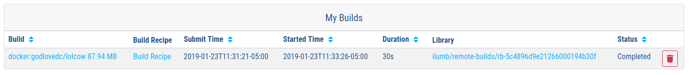
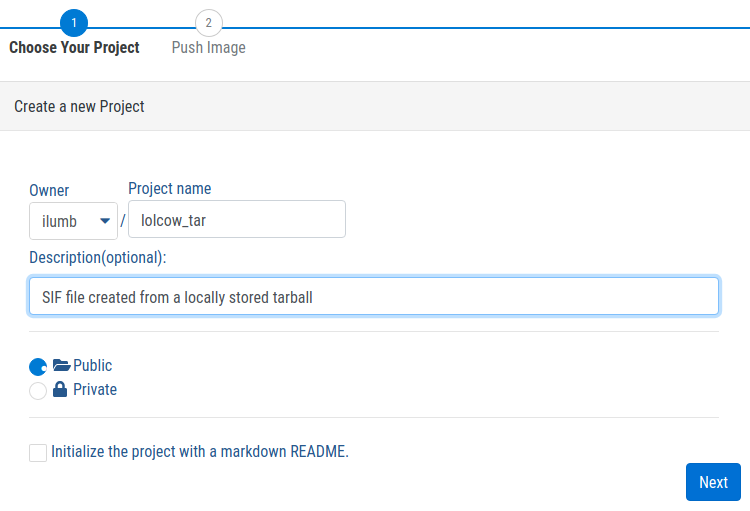
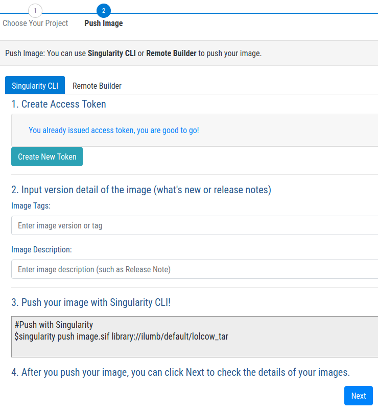
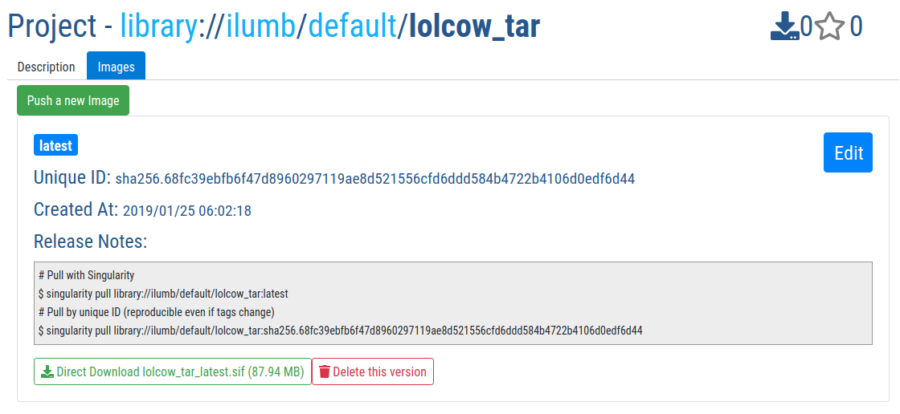
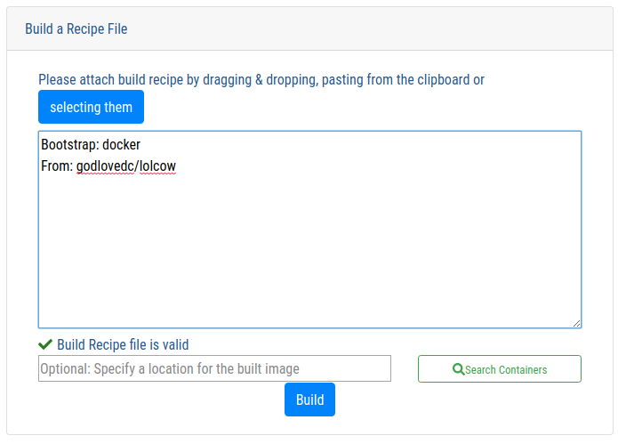
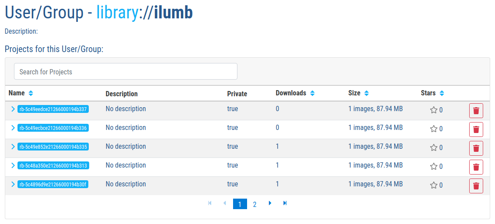

.. _singularity-and-docker:

=====================================
Singularity and Docker/OCI containers
=====================================

.. TODO proof entire document for continuity, clarity, etc. 

--------
Overview
--------

.. TODO Overview content ... 
.. no need for the Docker daemon 

.. Review the overview of the Sy interface ... 

.. TODO - from the changelog for 3.0 re: docker & oci URIs/images handling ... use here???: 
.. Handling of docker & oci URIs/images now utilizes containers/image to parse and convert those image types in a supported way https://github.com/containers/image

.. TODO account for oci and oci-archive ... somewhere in this section 

.. _sec:action_commands_prebuilt_public_docker_images:

----------------------------------------------------------------------
Running action commands on pre-built public images from the Docker Hub
----------------------------------------------------------------------

``godlovedc/lolcow`` is a whimsical example of a public image hosted via `the Docker Hub <https://hub.docker.com/>`_. Singularity can ``run`` this image as follows:

.. code-block:: none

    $ singularity run docker://godlovedc/lolcow
    INFO:    Converting OCI blobs to SIF format
    INFO:    Starting build...
    Getting image source signatures
    Copying blob sha256:9fb6c798fa41e509b58bccc5c29654c3ff4648b608f5daa67c1aab6a7d02c118
     45.33 MiB / 45.33 MiB [====================================================] 1s
    Copying blob sha256:3b61febd4aefe982e0cb9c696d415137384d1a01052b50a85aae46439e15e49a
     848 B / 848 B [============================================================] 0s
    Copying blob sha256:9d99b9777eb02b8943c0e72d7a7baec5c782f8fd976825c9d3fb48b3101aacc2
     621 B / 621 B [============================================================] 0s
    Copying blob sha256:d010c8cf75d7eb5d2504d5ffa0d19696e8d745a457dd8d28ec6dd41d3763617e
     853 B / 853 B [============================================================] 0s
    Copying blob sha256:7fac07fb303e0589b9c23e6f49d5dc1ff9d6f3c8c88cabe768b430bdb47f03a9
     169 B / 169 B [============================================================] 0s
    Copying blob sha256:8e860504ff1ee5dc7953672d128ce1e4aa4d8e3716eb39fe710b849c64b20945
     53.75 MiB / 53.75 MiB [====================================================] 2s
    Copying config sha256:73d5b1025fbfa138f2cacf45bbf3f61f7de891559fa25b28ab365c7d9c3cbd82
     3.33 KiB / 3.33 KiB [======================================================] 0s
    Writing manifest to image destination
    Storing signatures
    INFO:    Creating SIF file...
    INFO:    Build complete: /home/vagrant/.singularity/cache/oci-tmp/a692b57abc43035b197b10390ea2c12855d21649f2ea2cc28094d18b93360eeb/lolcow_latest.sif
    INFO:    Image cached as SIF at /home/vagrant/.singularity/cache/oci-tmp/a692b57abc43035b197b10390ea2c12855d21649f2ea2cc28094d18b93360eeb/lolcow_latest.sif
     ___________________________________
    / Repartee is something we think of \
    | twenty-four hours too late.       |
    |                                   |
    \ -- Mark Twain                     /
     -----------------------------------
            \   ^__^
             \  (oo)\_______
                (__)\       )\/\
                    ||----w |
                    ||     ||

``docker`` is prepended to ensure that the ``run`` command of Singularity is instructed to boostrap container creation based upon this Docker image; thus creating a complete URI for Singularity. Singularity subsequently downloads all the OCI blobs that comprise this image, and converts them into a *single* SIF file - the native format for Singularity containers. Because this image from the Docker Hub is cached locally in the ``$HOME/.singularity/cache/oci-tmp/<unique cache string>/lolcow_latest.sif`` directory, the image does not need to be downloaded again (from the Docker Hub) the next time a Singularity ``run`` is executed. In other words, the cached copy is sensibly reused: 

.. code-block:: none

    $ singularity run docker://godlovedc/lolcow
     _________________________________________
    / Soap and education are not as sudden as \
    | a massacre, but they are more deadly in |
    | the long run.                           |
    |                                         |
    \ -- Mark Twain                           /
     -----------------------------------------
            \   ^__^
             \  (oo)\_______
                (__)\       )\/\
                    ||----w |
                    ||     ||

As the runtime of this container is encapsulated as a single SIF file, it is possible to ``cd /home/vagrant/.singularity/cache/oci-tmp/a692b57abc43035b197b10390ea2c12855d21649f2ea2cc28094d18b93360eeb/``, and then execute the SIF file directly:

.. code-block:: none

    ./lolcow_latest.sif 
     _______________________________________
    / The secret source of humor is not joy \
    | but sorrow; there is no humor in      |
    | Heaven.                               |
    |                                       |
    \ -- Mark Twain                         /
     ---------------------------------------
            \   ^__^
             \  (oo)\_______
                (__)\       )\/\
                    ||----w |
                    ||     ||

.. note:: 

    SIF files abstract Singularity containers as a single file. As with any executable, a SIF file can be executed directly. 

``fortune | cowsay | lolcat`` is executed by *default* when this container is ``run`` by Singularity. Singularity's ``exec`` command allows a different command to be executed; for example: 

.. code-block:: none 

    $ singularity exec docker://godlovedc/lolcow fortune
    Don't go around saying the world owes you a living.  The world owes you
    nothing.  It was here first.
            -- Mark Twain

.. note::

    The *same* cached copy of the ``lolcow`` container is reused here by Singularity ``exec``, and immediately below here by ``shell``. 

In addition to non-interactive execution of an image from the Docker Hub, Singularity provides support for an *interactive* ``shell`` session: 

.. code-block:: none 

    $ singularity shell docker://godlovedc/lolcow 
    Singularity lolcow_latest.sif:~> cat /etc/os-release 
    NAME="Ubuntu"
    VERSION="16.04.3 LTS (Xenial Xerus)"
    ID=ubuntu
    ID_LIKE=debian
    PRETTY_NAME="Ubuntu 16.04.3 LTS"
    VERSION_ID="16.04"
    HOME_URL="http://www.ubuntu.com/"
    SUPPORT_URL="http://help.ubuntu.com/"
    BUG_REPORT_URL="http://bugs.launchpad.net/ubuntu/"
    VERSION_CODENAME=xenial
    UBUNTU_CODENAME=xenial
    Singularity lolcow_latest.sif:~> 

From this it is evident that use is being made of Ubuntu 16.04 *within* this container, whereas the shell *external* to the container is running a more-recent release of Ubuntu (not illustrated here). 

.. TODO add content re: singularity capability - possibly a new section 

.. TODO add content re: singularity instance - possibly a new section ... review first sushma-98's edits for the running services page 

.. _sec:use_prebuilt_public_docker_images:

---------------------------------------------------------
Making use of pre-built public images from the Docker Hub
---------------------------------------------------------

Singularity can make use of pre-built public images available from the `Docker Hub <https://hub.docker.com/>`_. By specifying the ``docker://`` URI for an image you have already located, Singularity can ``pull``  it - e.g.: 

.. code-block:: none

    $ singularity pull docker://godlovedc/lolcow
    WARNING: Authentication token file not found : Only pulls of public images will succeed
    INFO:    Starting build...
    Getting image source signatures
    Copying blob sha256:9fb6c798fa41e509b58bccc5c29654c3ff4648b608f5daa67c1aab6a7d02c118
     45.33 MiB / 45.33 MiB [====================================================] 2s
    Copying blob sha256:3b61febd4aefe982e0cb9c696d415137384d1a01052b50a85aae46439e15e49a
     848 B / 848 B [============================================================] 0s
    Copying blob sha256:9d99b9777eb02b8943c0e72d7a7baec5c782f8fd976825c9d3fb48b3101aacc2
     621 B / 621 B [============================================================] 0s
    Copying blob sha256:d010c8cf75d7eb5d2504d5ffa0d19696e8d745a457dd8d28ec6dd41d3763617e
     853 B / 853 B [============================================================] 0s
    Copying blob sha256:7fac07fb303e0589b9c23e6f49d5dc1ff9d6f3c8c88cabe768b430bdb47f03a9
     169 B / 169 B [============================================================] 0s
    Copying blob sha256:8e860504ff1ee5dc7953672d128ce1e4aa4d8e3716eb39fe710b849c64b20945
     53.75 MiB / 53.75 MiB [====================================================] 3s
    Copying config sha256:73d5b1025fbfa138f2cacf45bbf3f61f7de891559fa25b28ab365c7d9c3cbd82
     3.33 KiB / 3.33 KiB [======================================================] 0s
    Writing manifest to image destination
    Storing signatures
    INFO:    Creating SIF file...
    INFO:    Build complete: lolcow_latest.sif

This ``pull`` results in a *local* copy of the Docker image in SIF, the Singularity Image Format:

.. code-block:: none

    $ file lolcow_latest.sif 
    lolcow_latest.sif: a /usr/bin/env run-singularity script executable (binary data)

In translating to SIF, individual layers of the Docker image have been *combined* into a single, native file for use via Singularity; there is no need to subsequently ``build`` the image for Singularity. For example, you can now ``exec``, ``run`` or ``shell`` into the SIF version via Singularity. See :ref:`Interact with images <quick-start>`. 

.. TODO improve ref above to quick start ... interact 

.. TODO Should explain here or in previous section that docker to Singularity is 
    .. a one-way operation because info is lost.
    .. Also some words on how this is considered less reproducible than pulling
    .. from the container library.  

.. note:: 

    The above authentication warning originates from a check for the existence of ``${HOME}/.singularity/sylabs-token``. It can be ignored when making use of the Docker Hub. 

.. note:: 

    ``singularity search [search options...] <search query>`` does *not* support Docker registries like `Docker Hub <https://hub.docker.com/>`_. Use the search box at Docker Hub to locate Docker images. Docker ``pull`` commands, e.g., ``docker pull godlovedc/lolcow``, can be easily translated into the corresponding command for Singularity. The Docker ``pull`` command is available under "DETAILS" for a given image on Docker Hub. 

.. _sec:use_prebuilt_public_docker_images_SUB_inspect:

``inspect`` reveals metadata for the container encapsulated via SIF:

.. code-block:: none

        $ singularity inspect lolcow_latest.sif 

        {
            "org.label-schema.build-date": "Thursday_6_December_2018_17:29:48_UTC",
            "org.label-schema.schema-version": "1.0",
            "org.label-schema.usage.singularity.deffile.bootstrap": "docker",
            "org.label-schema.usage.singularity.deffile.from": "godlovedc/lolcow",
            "org.label-schema.usage.singularity.version": "3.0.1-40.g84083b4f"
        }

SIF files built from Docker images are *not* crytographically signed:

.. code-block:: none

    $ singularity verify lolcow_latest.sif 
    Verifying image: lolcow_latest.sif
    ERROR:   verification failed: error while searching for signature blocks: no signatures found for system partition

The ``sign`` command allows a cryptographic signature to be added. Refer to 
:ref:`Signing and Verifying Containers <signNverify>` for details. But caution
should be exercised in signing images from Docker Hub because, unless you build
an image from scratch (OS mirrors) you are probably not really sure about the
complete contents of that image. 

.. note::

    ``pull`` actually builds a SIF file that corresponds to the image you retrieved from the Docker Hub. Updates to the image on the Docker Hub will *not* be reflected in your *local* copy. 

.. TODO explain the full Docker URI - add the line below to a larger discussion - the existing 
    explanation is pretty good, but probably needs style edits.  

In our example ``docker://godlovedc/lolcow``, ``godlovedc`` specifies a Docker Hub user, whereas ``lolcow`` is the name of the repository. Adding the option to specifiy an image tag, the generic version of the URI is ``docker://<hub-user>/<repo-name>[:<tag>]``. `Repositories on Docker Hub <https://docs.docker.com/docker-hub/repos/>`_ provides additional details.

.. TODO Docker layers = OCI blobs ??? need note re: repeat blob here??? 

.. _sec:using_prebuilt_private_images:

----------------------------------------------------------
Making use of pre-built private images from the Docker Hub
----------------------------------------------------------

After successful authentication, Singularity can also make use of pre-built *private* images available from the `Docker Hub <https://hub.docker.com/>`_. The three means available for authentication follow here. Before describing these means, it is instructive to illustate the error generated when attempting access a private image *without* credentials:

.. code-block:: none

    $ singularity pull docker://ilumb/mylolcow
    INFO:    Starting build...
    FATAL:   Unable to pull docker://ilumb/mylolcow: conveyor failed to get: Error reading manifest latest in docker.io/ilumb/mylolcow: errors:
    denied: requested access to the resource is denied
    unauthorized: authentication required

In this case, the ``mylolcow`` repository of user ``ilumb`` **requires** authentication through specification of a valid username and password. 

.. _sec:authentication_via_docker_login: 

Authentication via Interactive Login
====================================

Interactive login is the first of three means provided for authentication with the Docker Hub. It is enabled through use of the ``--docker-login`` option of Singularity's ``pull`` command; for example:

.. code-block:: none 

    $ singularity pull --docker-login docker://ilumb/mylolcow
    Enter Docker Username: ilumb
    Enter Docker Password: 
    INFO:    Starting build...
    Getting image source signatures
    Skipping fetch of repeat blob sha256:7b8b6451c85f072fd0d7961c97be3fe6e2f772657d471254f6d52ad9f158a580
    Skipping fetch of repeat blob sha256:ab4d1096d9ba178819a3f71f17add95285b393e96d08c8a6bfc3446355bcdc49
    Skipping fetch of repeat blob sha256:e6797d1788acd741d33f4530106586ffee568be513d47e6e20a4c9bc3858822e
    Skipping fetch of repeat blob sha256:e25c5c290bded5267364aa9f59a18dd22a8b776d7658a41ffabbf691d8104e36
    Skipping fetch of repeat blob sha256:258e068bc5e36969d3ba4b47fd3ca0d392c6de465726994f7432b14b0414d23b
    Copying config sha256:8a8f815257182b770d32dffff7f185013b4041d076e065893f9dd1e89ad8a671
     3.12 KiB / 3.12 KiB [======================================================] 0s
    Writing manifest to image destination
    Storing signatures
    INFO:    Creating SIF file...
    INFO:    Build complete: mylolcow_latest.sif

After successful authentication, the private Docker image is pulled and converted to SIF as described above. 

.. note::

    For interactive sessions, ``--docker-login`` is recommended as use of plain-text passwords in your environment is *avoided*. Encoded authentication data is communicated with the Docker Hub via secure HTTP. 

.. _sec:authentication_via_environment_variables: 

Authentication via Environment Variables
========================================

Environment variables offer an alternative means for authentication with the Docker Hub. The **required** exports are as follows:

.. code-block:: none

    export SINGULARITY_DOCKER_USERNAME=ilumb
    export SINGULARITY_DOCKER_PASSWORD=<redacted>

Of course, the ``<redacted>`` plain-text password needs to be replaced by a valid one to be of practical use. 

.. note:: 

    This approach for authentication supports both interactive and non-interactive sessions. However, the requirement for a plain-text password assigned to an envrionment variable, is a security compromise for this flexibility. 

.. note:: 

    When specifying passwords, 'special characters' (e.g., ``$``, ``#``, ``.``) need to be escaped to avoid interpretation by the shell. 
 
.. TODO testing auth - updated from the 2.6 docs - needed?

.. _sec:using_prebuilt_private_images_parivate_registries:

--------------------------------------------------------------
Making use of pre-built private images from Private Registries
--------------------------------------------------------------

Authentication is required to access *private* images that reside in the Docker Hub. Of course, private images can also reside in **private registries**. Accounting for locations *other* than the Docker Hub is easily achieved. 

In the complete command line specification

.. code-block:: none

    docker://<registry>/<hub-user>/<repo-name>[:<tag>]

``registry`` defaults to ``index.docker.io``. In other words,

.. code-block:: none

    $ singularity pull docker://godlovedc/lolcow

is functionally equivalent to 

.. code-block:: none

    $ singularity pull docker://index.docker.io/godlovedc/lolcow

From the above example, it is evident that 

.. code-block:: none

    $ singularity pull docker://nvcr.io/nvidia/pytorch:18.11-py3
    INFO:    Starting build...
    Getting image source signatures
    Skipping fetch of repeat blob sha256:18d680d616571900d78ee1c8fff0310f2a2afe39c6ed0ba2651ff667af406c3e
    <blob fetching details deleted>
    Skipping fetch of repeat blob sha256:c71aeebc266c779eb4e769c98c935356a930b16d881d7dde4db510a09cfa4222
    Copying config sha256:b77551af8073c85588088ab2a39007d04bc830831ba1eef4127b2d39aaf3a6b1
     21.28 KiB / 21.28 KiB [====================================================] 0s
    Writing manifest to image destination
    Storing signatures
    INFO:    Creating SIF file...
    INFO:    Build complete: pytorch_18.11-py3.sif

will retrieve a specific version of the `PyTorch platform <https://pytorch.org/>`_ for Deep Learning from the NVIDIA GPU Cloud (NGC). Because NGC is a private registry, the above ``pull`` assumes :ref:`authentication via environment variables <sec:authentication_via_environment_variables>` when the blobs that collectively comprise the Docker image have not already been cached locally. In the NGC case, the required environment variable are set as follows:

.. code-block:: none 

    export SINGULARITY_DOCKER_USERNAME=$oauthtoken
    export SINGULARITY_DOCKER_PASSWORD=<redacted>

Upon use, these environment-variable settings allow for authentication with NGC.

.. note::

    The password provided via these means is actually an API token. This token is generated via your NGC account, and is **required** for use of the service. For additional details regarding authentication with NGC, and much more, please consult their `Getting Started <https://docs.nvidia.com/ngc/ngc-getting-started-guide/index.html>`_ documentation. 

Alternatively, for purely interactive use, ``--docker-login`` is recommended:

.. code-block:: none

    $ singularity pull --docker-login docker://nvcr.io/nvidia/pytorch:18.11-py3
    Enter Docker Username: $oauthtoken
    Enter Docker Password: 
    INFO:    Starting build...
    Getting image source signatures
    Skipping fetch of repeat blob sha256:18d680d616571900d78ee1c8fff0310f2a2afe39c6ed0ba2651ff667af406c3e
    <blob fetching details deleted>
    Skipping fetch of repeat blob sha256:c71aeebc266c779eb4e769c98c935356a930b16d881d7dde4db510a09cfa4222
    Copying config sha256:b77551af8073c85588088ab2a39007d04bc830831ba1eef4127b2d39aaf3a6b1
    21.28 KiB / 21.28 KiB [====================================================] 0s
    Writing manifest to image destination
    Storing signatures
    INFO:    Creating SIF file...
    INFO:    Build complete: pytorch_18.11-py3.sif

Authentication aside, the outcome of the ``pull`` is the Singularity container ``pytorch_18.11-py3.sif`` in SIF. 

------------------------------------------------------
Building images for Singularity from Docker Registries
------------------------------------------------------

The ``build`` command is used to **create** Singularity containers. Because it is documented extensively :ref:`elsewhere in this manual <build-a-container>`, only specifics relevant to Docker are provided here - namely, working with the Docker Hub via the Singularity command line and through Singularity definition files. 

Working from the Singularity Command Line
=========================================

Remotely Hosted Images
----------------------

In the simplest case, ``build`` is functionally equivalent to ``pull``: 

.. code-block:: none

    $ singularity build mylolcow_latest.sif docker://godlovedc/lolcow
    INFO:    Starting build...
    Getting image source signatures
    Skipping fetch of repeat blob sha256:9fb6c798fa41e509b58bccc5c29654c3ff4648b608f5daa67c1aab6a7d02c118
    Skipping fetch of repeat blob sha256:3b61febd4aefe982e0cb9c696d415137384d1a01052b50a85aae46439e15e49a
    Skipping fetch of repeat blob sha256:9d99b9777eb02b8943c0e72d7a7baec5c782f8fd976825c9d3fb48b3101aacc2
    Skipping fetch of repeat blob sha256:d010c8cf75d7eb5d2504d5ffa0d19696e8d745a457dd8d28ec6dd41d3763617e
    Skipping fetch of repeat blob sha256:7fac07fb303e0589b9c23e6f49d5dc1ff9d6f3c8c88cabe768b430bdb47f03a9
    Skipping fetch of repeat blob sha256:8e860504ff1ee5dc7953672d128ce1e4aa4d8e3716eb39fe710b849c64b20945
    Copying config sha256:73d5b1025fbfa138f2cacf45bbf3f61f7de891559fa25b28ab365c7d9c3cbd82
     3.33 KiB / 3.33 KiB [======================================================] 0s
    Writing manifest to image destination
    Storing signatures
    INFO:    Creating SIF file...
    INFO:    Build complete: mylolcow_latest.sif

This ``build`` results in a *local* copy of the Docker image in SIF, as did ``pull`` :ref:`above <sec:use_prebuilt_public_docker_images>`. Of course, ``build`` allows the name of the Singularity container to be specified as ``mylolcow_latest.sif``, whereas ``pull`` does not support this capability. 

.. note::

     ``docker://godlovedc/lolcow`` is the target provided as input for ``build``. Armed with this target, ``build`` applies the appropriate method to create the container - in this case, one appropriate for the Docker Hub. 

In addition to a read-only container image in SIF (**default**), ``build`` allows for the creation of a writable (ch)root directory called a sandbox for interactive development via the ``--sandbox`` option: 

.. code-block:: none

    $ singularity build --sandbox mylolcow_latest_sandbox.sif docker://godlovedc/lolcow
    INFO:    Starting build...
    Getting image source signatures
    Skipping fetch of repeat blob sha256:9fb6c798fa41e509b58bccc5c29654c3ff4648b608f5daa67c1aab6a7d02c118
    Skipping fetch of repeat blob sha256:3b61febd4aefe982e0cb9c696d415137384d1a01052b50a85aae46439e15e49a
    Skipping fetch of repeat blob sha256:9d99b9777eb02b8943c0e72d7a7baec5c782f8fd976825c9d3fb48b3101aacc2
    Skipping fetch of repeat blob sha256:d010c8cf75d7eb5d2504d5ffa0d19696e8d745a457dd8d28ec6dd41d3763617e
    Skipping fetch of repeat blob sha256:7fac07fb303e0589b9c23e6f49d5dc1ff9d6f3c8c88cabe768b430bdb47f03a9
    Skipping fetch of repeat blob sha256:8e860504ff1ee5dc7953672d128ce1e4aa4d8e3716eb39fe710b849c64b20945
    Copying config sha256:73d5b1025fbfa138f2cacf45bbf3f61f7de891559fa25b28ab365c7d9c3cbd82
     3.33 KiB / 3.33 KiB [======================================================] 0s
    Writing manifest to image destination
    Storing signatures
    INFO:    Creating sandbox directory...
    INFO:    Build complete: mylolcow_latest_sandbox.sif

After successful execution, the above command results in creation of the ``mylolcow_latest_sandbox.sif`` directory with contents:

.. code-block:: none

    bin  boot  core  dev  environment  etc  home  lib  lib64  media  mnt  opt  proc  root  run  sbin  singularity  srv  sys  tmp  usr  var

The ``build`` command of Singularity allows (e.g., development) sandbox containers to be converted into (e.g., production) read-only SIF containers, and vice-versa. Consult the :ref:`Build a container <build-a-container>` documentation for the details. 

Implicit in the above command-line interactions is use of pre-built public images from the Docker Hub. To make use of pre-built **private** images from the Docker Hub, authentication is required. Available means for authentication were described above. Use of environment variables is functionally equivalent for Singularity ``build`` as it is for ``pull``; see :ref:`Authentication via Environment Variables <sec:authentication_via_environment_variables>` above. For purely interactive use, authentication can be added to the ``build`` command as follows:

.. code-block:: none

    singularity build --docker-login mylolcow_latest_il.sif docker://ilumb/mylolcow

(Recall that ``docker://ilumb/mylolcow`` is a private image available via the Docker Hub.) See :ref:`Authentication via Interactive Login <sec:authentication_via_docker_login>` above regarding use of ``--docker-login``.

Remotely Hosted and Built Containers
------------------------------------

SIF containers can be **remotely built**, from images remotely hosted at the Docker Hub, via the `Sylabs Cloud Remote Builder <https://cloud.sylabs.io/builder>`_. The Sylabs Cloud Remote Builder is a service that can be used from the Singularity command line or via its Web interface. Here use of the Singularity CLI is emphasized. 

Once you have an account for Sylabs Cloud, and have logged in to the portal, select `Remote Builder <https://cloud.sylabs.io/builder>`_. The right-hand side of this page is devoted to use of the Singularity CLI. Self-generated API tokens are used to enable authenticated access to the Remote Builder. To create a 30-day token, follow the `instructions provided <https://cloud.sylabs.io/auth/tokens>`_. Once the token has been created, store it in the file ``$HOME/.singularity/sylabs-token``. 

The above token provides authenticated use of the Sylabs Cloud Remote Builder when ``--remote`` is appended to the Singularity ``build`` command. For example, for remotely hosted images: 

.. code-block:: none 

    $ singularity build --remote lolcow_rb.sif docker://godlovedc/lolcow
    searching for available build agent.........INFO:    Starting build...
    Getting image source signatures
    Copying blob sha256:9fb6c798fa41e509b58bccc5c29654c3ff4648b608f5daa67c1aab6a7d02c118
     45.33 MiB / 45.33 MiB  0s
    Copying blob sha256:3b61febd4aefe982e0cb9c696d415137384d1a01052b50a85aae46439e15e49a
     848 B / 848 B  0s
    Copying blob sha256:9d99b9777eb02b8943c0e72d7a7baec5c782f8fd976825c9d3fb48b3101aacc2
     621 B / 621 B  0s
    Copying blob sha256:d010c8cf75d7eb5d2504d5ffa0d19696e8d745a457dd8d28ec6dd41d3763617e
     853 B / 853 B  0s
    Copying blob sha256:7fac07fb303e0589b9c23e6f49d5dc1ff9d6f3c8c88cabe768b430bdb47f03a9
     169 B / 169 B  0s
    Copying blob sha256:8e860504ff1ee5dc7953672d128ce1e4aa4d8e3716eb39fe710b849c64b20945
     53.75 MiB / 53.75 MiB  0s
    Copying config sha256:73d5b1025fbfa138f2cacf45bbf3f61f7de891559fa25b28ab365c7d9c3cbd82
     3.33 KiB / 3.33 KiB  0s
    Writing manifest to image destination
    Storing signatures
    INFO:    Creating SIF file...
    INFO:    Build complete: /tmp/image-341891107
    INFO:    Now uploading /tmp/image-341891107 to the library
     87.94 MiB / 87.94 MiB  100.00% 38.96 MiB/s 2s
    INFO:    Setting tag latest
     87.94 MiB / 87.94 MiB [===============================================================================] 100.00% 17.23 MiB/s 5s

During the build process, progress can be monitored in the Sylabs Cloud portal on the Remote Builder page - as illustrated upon completion by the screenshot below. Once complete, this results in a *local* copy of the SIF file ``lolcow_rb.sif``. From the `Sylabs Cloud Singularity Library <https://cloud.sylabs.io/library>`_ it is evident that the 'original' SIF file remains available via this portal. 

.. _sec:mandatory_headers_docker_locally_boostrapped_cli:

Locally Available Images: Cached by Docker
------------------------------------------

Singularity containers can be built at the command line from images cached locally by Docker. Suppose, for example: 

.. code-block:: none

    $ sudo docker images
    REPOSITORY          TAG                 IMAGE ID            CREATED             SIZE
    godlovedc/lolcow    latest              577c1fe8e6d8        16 months ago       241MB

This indicates that ``godlovedc/lolcow:latest`` has been cached locally by Docker. Then 

.. code-block:: none

    $ sudo singularity build lolcow_from_docker_cache.sif docker-daemon://godlovedc/lolcow:latest
    INFO:    Starting build...
    Getting image source signatures
    Copying blob sha256:a2022691bf950a72f9d2d84d557183cb9eee07c065a76485f1695784855c5193
     119.83 MiB / 119.83 MiB [==================================================] 6s
    Copying blob sha256:ae620432889d2553535199dbdd8ba5a264ce85fcdcd5a430974d81fc27c02b45
     15.50 KiB / 15.50 KiB [====================================================] 0s
    Copying blob sha256:c561538251751e3685c7c6e7479d488745455ad7f84e842019dcb452c7b6fecc
     14.50 KiB / 14.50 KiB [====================================================] 0s
    Copying blob sha256:f96e6b25195f1b36ad02598b5d4381e41997c93ce6170cab1b81d9c68c514db0
     5.50 KiB / 5.50 KiB [======================================================] 0s
    Copying blob sha256:7f7a065d245a6501a782bf674f4d7e9d0a62fa6bd212edbf1f17bad0d5cd0bfc
     3.00 KiB / 3.00 KiB [======================================================] 0s
    Copying blob sha256:70ca7d49f8e9c44705431e3dade0636a2156300ae646ff4f09c904c138728839
     116.56 MiB / 116.56 MiB [==================================================] 6s
    Copying config sha256:73d5b1025fbfa138f2cacf45bbf3f61f7de891559fa25b28ab365c7d9c3cbd82
     3.33 KiB / 3.33 KiB [======================================================] 0s
    Writing manifest to image destination
    Storing signatures
    INFO:    Creating SIF file...
    INFO:    Build complete: lolcow_from_docker_cache.sif

results in ``lolcow_from_docker_cache.sif`` for native use by Singularity. There are two important differences in syntax evident in the above ``build`` command:

    1. The ``docker`` part of the URI has been appended by ``daemon``. This ensures Singularity seek an image locally cached by Docker to boostrap the conversion process to SIF, as opposed to attempting to retrieve an image remnotely hosted via the Docker Hub. 

    2. ``sudo`` is prepended to the ``build`` command for Singularity. This is required as the Docker daemon executes as ``root``.  

.. note:: 

    The image tag, in this case ``latest``, is **required** when bootstrapping creation of a container for Singularity from an image locally cached by Docker. 

.. note:: 

    The Sylabs Cloud Remote Builder *does not* interoperate with local Docker daemons; therefore, images cached locally by Docker, *cannot* be used to bootstrap creation of SIF files via the Remote Builder service. Of course, a SIF file could be created locally as detailed above. Then, in a separate, manual step, :ref:`pushed to the Sylabs Cloud Singularity Library <sec:pushing_locally_available_images_to_library>`. 
 

.. _sec:mandatory_headers_docker_locally_stored_bootstrap_cli:

Locally Available Images: Stored Archives
------------------------------------------

Singularity containers can also be built at the command line from Docker images stored locally as ``tar`` files. Suppose, for example, ``lolcow.tar`` is locally stored archive in the *current* working directory; then the contents of this archive can be revealed as follows:

.. code-block:: none 

    $ tar tvf lolcow.tar 
    drwxr-xr-x 0/0               0 2017-09-21 19:37 02aefa059d08482d344293d0ad27182a0a9d330ebc73abd92a1f9744844f91e9/
    -rw-r--r-- 0/0               3 2017-09-21 19:37 02aefa059d08482d344293d0ad27182a0a9d330ebc73abd92a1f9744844f91e9/VERSION
    -rw-r--r-- 0/0            1417 2017-09-21 19:37 02aefa059d08482d344293d0ad27182a0a9d330ebc73abd92a1f9744844f91e9/json
    -rw-r--r-- 0/0       122219008 2017-09-21 19:37 02aefa059d08482d344293d0ad27182a0a9d330ebc73abd92a1f9744844f91e9/layer.tar
    drwxr-xr-x 0/0               0 2017-09-21 19:37 3762e087ebbb895fd9c38981c1f7bfc76c9879fd3fdadef64df49e92721bb527/
    -rw-r--r-- 0/0               3 2017-09-21 19:37 3762e087ebbb895fd9c38981c1f7bfc76c9879fd3fdadef64df49e92721bb527/VERSION
    -rw-r--r-- 0/0             482 2017-09-21 19:37 3762e087ebbb895fd9c38981c1f7bfc76c9879fd3fdadef64df49e92721bb527/json
    -rw-r--r-- 0/0           14848 2017-09-21 19:37 3762e087ebbb895fd9c38981c1f7bfc76c9879fd3fdadef64df49e92721bb527/layer.tar
    -rw-r--r-- 0/0            4432 2017-09-21 19:37 577c1fe8e6d84360932b51767b65567550141af0801ff6d24ad10963e40472c5.json
    drwxr-xr-x 0/0               0 2017-09-21 19:37 5bad884501c0e760bc0c9ca3ae3dca3f12c4abeb7d18194c364fec522b91b4f9/
    -rw-r--r-- 0/0               3 2017-09-21 19:37 5bad884501c0e760bc0c9ca3ae3dca3f12c4abeb7d18194c364fec522b91b4f9/VERSION
    -rw-r--r-- 0/0             482 2017-09-21 19:37 5bad884501c0e760bc0c9ca3ae3dca3f12c4abeb7d18194c364fec522b91b4f9/json
    -rw-r--r-- 0/0            3072 2017-09-21 19:37 5bad884501c0e760bc0c9ca3ae3dca3f12c4abeb7d18194c364fec522b91b4f9/layer.tar
    drwxr-xr-x 0/0               0 2017-09-21 19:37 81ce2fd011bc8241ae72eaee9146116b7c289e941467ff276397720171e6c576/
    -rw-r--r-- 0/0               3 2017-09-21 19:37 81ce2fd011bc8241ae72eaee9146116b7c289e941467ff276397720171e6c576/VERSION
    -rw-r--r-- 0/0             406 2017-09-21 19:37 81ce2fd011bc8241ae72eaee9146116b7c289e941467ff276397720171e6c576/json
    -rw-r--r-- 0/0       125649920 2017-09-21 19:37 81ce2fd011bc8241ae72eaee9146116b7c289e941467ff276397720171e6c576/layer.tar
    drwxr-xr-x 0/0               0 2017-09-21 19:37 a10239905b060fd8b17ab31f37957bd126774f52f5280767d3b2639692913499/
    -rw-r--r-- 0/0               3 2017-09-21 19:37 a10239905b060fd8b17ab31f37957bd126774f52f5280767d3b2639692913499/VERSION
    -rw-r--r-- 0/0             482 2017-09-21 19:37 a10239905b060fd8b17ab31f37957bd126774f52f5280767d3b2639692913499/json
    -rw-r--r-- 0/0           15872 2017-09-21 19:37 a10239905b060fd8b17ab31f37957bd126774f52f5280767d3b2639692913499/layer.tar
    drwxr-xr-x 0/0               0 2017-09-21 19:37 ab6e1ca3392b2f4dbb60157cf99434b6975f37a767f530e293704a7348407634/
    -rw-r--r-- 0/0               3 2017-09-21 19:37 ab6e1ca3392b2f4dbb60157cf99434b6975f37a767f530e293704a7348407634/VERSION
    -rw-r--r-- 0/0             482 2017-09-21 19:37 ab6e1ca3392b2f4dbb60157cf99434b6975f37a767f530e293704a7348407634/json
    -rw-r--r-- 0/0            5632 2017-09-21 19:37 ab6e1ca3392b2f4dbb60157cf99434b6975f37a767f530e293704a7348407634/layer.tar
    -rw-r--r-- 0/0             574 1970-01-01 01:00 manifest.json

In other words, it is evident that this 'tarball' is a Docker-format image comprised of multiple layers along with metadata in a JSON manifest. 

.. TODO check the JSON manifest stmt above 

Through use of the ``docker-archive`` bootstrap agent, a SIF file (``lolcow_tar.sif``) for use by Singularity can be created via the following ``build`` command:

.. code-block:: none 

    $ singularity build lolcow_tar.sif docker-archive://lolcow.tar
    INFO:    Starting build...
    Getting image source signatures
    Copying blob sha256:a2022691bf950a72f9d2d84d557183cb9eee07c065a76485f1695784855c5193
     119.83 MiB / 119.83 MiB [==================================================] 6s
    Copying blob sha256:ae620432889d2553535199dbdd8ba5a264ce85fcdcd5a430974d81fc27c02b45
     15.50 KiB / 15.50 KiB [====================================================] 0s
    Copying blob sha256:c561538251751e3685c7c6e7479d488745455ad7f84e842019dcb452c7b6fecc
     14.50 KiB / 14.50 KiB [====================================================] 0s
    Copying blob sha256:f96e6b25195f1b36ad02598b5d4381e41997c93ce6170cab1b81d9c68c514db0
     5.50 KiB / 5.50 KiB [======================================================] 0s
    Copying blob sha256:7f7a065d245a6501a782bf674f4d7e9d0a62fa6bd212edbf1f17bad0d5cd0bfc
     3.00 KiB / 3.00 KiB [======================================================] 0s
    Copying blob sha256:70ca7d49f8e9c44705431e3dade0636a2156300ae646ff4f09c904c138728839
     116.56 MiB / 116.56 MiB [==================================================] 6s
    Copying config sha256:73d5b1025fbfa138f2cacf45bbf3f61f7de891559fa25b28ab365c7d9c3cbd82
     3.33 KiB / 3.33 KiB [======================================================] 0s
    Writing manifest to image destination
    Storing signatures
    INFO:    Creating SIF file...
    INFO:    Build complete: lolcow_tar.sif

There are two important differences in syntax evident in the above ``build`` command:

    1. The ``docker`` part of the URI has been appended by ``archive``. This ensures Singularity seek a Docker-format image stored locally as ``lolcow.tar`` to boostrap the conversion process to SIF, as opposed to attempting to retrieve an image remnotely hosted via the Docker Hub. 

    2. ``sudo`` is *not* prepended to the ``build`` command for Singularity. This is *not* required if the executing user has the appropriate access privileges to the stored file.  

.. note::

    The ``docker-archive`` bootstrap agent handles archives (``.tar`` files) as well as compressed archives (``.tar.gz``) when containers are built for Singularity via its ``build`` command. 

.. note:: 

    The Sylabs Cloud Remote Builder *does not* interoperate with locally stored Docker-format images; therefore, images cached locally by Docker, *cannot* be used to bootstrap creation of SIF files via the Remote Builder service. Of course, a SIF file could be created locally as detailed above. Then, in a separate, manual step, :ref:`pushed to the Sylabs Cloud Singularity Library <sec:pushing_locally_available_images_to_library>`. 

.. _sec:pushing_locally_available_images_to_library:

Pushing Locally Available Images to a Library
---------------------------------------------

The outcome of bootstrapping from an image cached locally by Docker, or one stored locally as an archive, is of course a locally stored SIF file. As noted above, this is the *only* option available, as the Sylabs Cloud Remote Builder does not interoperate with the Docker daemon or locally stored archives in the Docker image format. Once produced, however, it may be desirable to  make the resulting SIF file available through the Sylabs Cloud Singularity Library; therefore, the procedure to ``push`` a locally available SIF file to the Library is detailed here. 

From the `Sylabs Cloud Singularity Library <https://cloud.sylabs.io/library>`_, select ``Create a new Project``. In this first of two steps, the publicly accessible project is created as illustrated below: 

Because an access token for the cloud service already exists, attention can be focused on the ``push`` command prototyped towards the bottom of the following screenshot:

In fact, by simply replacing ``image.sif`` with ``lolcow_tar.sif``, the following upload is executed: 

.. code-block:: none 

    $ singularity push lolcow_tar.sif library://ilumb/default/lolcow_tar
    INFO:    Now uploading lolcow_tar.sif to the library
     87.94 MiB / 87.94 MiB [=============================================================================] 100.00% 1.25 MiB/s 1m10s
    INFO:    Setting tag latest

Finally, from the perspective of the Library, the **hosted** version of the SIF file appears as illustrated below. Directions on how to ``pull`` this file are included. 

.. note:: 

    The hosted version of the SIF file in the Sylabs Cloud Singularity Library is maintainable. In other words, if the image is updated lcoally, the update can be pushed to the Library and tagged appropriately. 

Working with Definition Files
=============================

.. _sec:def_file_mandatory_headers_remotely_boostrapped: 

Mandatory Headers: Remotely Boostrapped
---------------------------------------

Akin to a set of blueprints that explain how to build a custom container, Singularity definition files (or "def files") are considered in detail :ref:`elsewhere in this manual <definition-files>`. Therefore, only def file nuances specific to interoperability with Docker receive consideration here. 

Singularity definition files are comprised of two parts - a **header** plus **sections**. 

When working with repositories such as the Docker Hub, ``Bootstrap`` and ``From`` are **mandatory** keywords within the header; for example, if the file ``lolcow.def`` has contents 

.. code-block:: singularity 

    Bootstrap: docker
    From: godlovedc/lolcow

then 

.. code-block:: none 

    sudo singularity build lolcow.sif lolcow.def

creates a Singularity container in SIF by bootstrapping from the public ``godlovedc/lolcow`` image from the Docker Hub. 

In the above definition file, ``docker`` is one of numerous, possible bootstrap agents; this, and other bootstrap agents receive attention :ref:`in the appendix <build-docker-module>`.    

.. TODO remote builder content  

Through the means for authentication described above, definition files permit use of private images hosted via the Docker Hub. For example, if the file ``mylolcow.def`` has contents

.. code-block:: singularity 

    Bootstrap: docker
    From: ilumb/mylolcow

then 

.. code-block:: none 

    sudo singularity build --docker-login mylolcow.sif mylolcow.def 

creates a Singularity container in SIF by bootstrapping from the *private* ``ilumb/mylolcow`` image from the Docker Hub after successful :ref:`interactive authentication <sec:authentication_via_docker_login>`. 

Alternatively, if :ref:`environment variables have been set as above <sec:authentication_via_environment_variables>`, then 

.. code-block:: none 

    sudo -E singularity build mylolcow.sif mylolcow.def

enables authenticated use of the private image. 

.. note:: 

    The ``-E`` option is required to preserve the user's existing environment variables upon ``sudo`` invocation - a priviledge escalation *required* to create Singularity containers via the ``build`` command. 

Remotely Bootstrapped and Built Containers
------------------------------------------

Consider again :ref:`the definition file used the outset of the section above <sec:def_file_mandatory_headers_remotely_boostrapped>`: 

.. code-block:: singularity 

    Bootstrap: docker
    From: godlovedc/lolcow

With two small adjustments to the Singularity ``build`` command, the Sylabs Cloud Remote Builder can be utilized:

.. code-block:: none 

    $ singularity build --remote lolcow_rb_def.sif lolcow.def
    searching for available build agent......INFO:    Starting build...
    Getting image source signatures
    Copying blob sha256:9fb6c798fa41e509b58bccc5c29654c3ff4648b608f5daa67c1aab6a7d02c118
     45.33 MiB / 45.33 MiB  0s
    Copying blob sha256:3b61febd4aefe982e0cb9c696d415137384d1a01052b50a85aae46439e15e49a
     848 B / 848 B  0s
    Copying blob sha256:9d99b9777eb02b8943c0e72d7a7baec5c782f8fd976825c9d3fb48b3101aacc2
     621 B / 621 B  0s
    Copying blob sha256:d010c8cf75d7eb5d2504d5ffa0d19696e8d745a457dd8d28ec6dd41d3763617e
     853 B / 853 B  0s
    Copying blob sha256:7fac07fb303e0589b9c23e6f49d5dc1ff9d6f3c8c88cabe768b430bdb47f03a9
     169 B / 169 B  0s
    Copying blob sha256:8e860504ff1ee5dc7953672d128ce1e4aa4d8e3716eb39fe710b849c64b20945
     53.75 MiB / 53.75 MiB  0s
    Copying config sha256:73d5b1025fbfa138f2cacf45bbf3f61f7de891559fa25b28ab365c7d9c3cbd82
     3.33 KiB / 3.33 KiB  0s
    Writing manifest to image destination
    Storing signatures
    INFO:    Creating SIF file...
    INFO:    Build complete: /tmp/image-994007654
    INFO:    Now uploading /tmp/image-994007654 to the library
     87.94 MiB / 87.94 MiB  100.00% 41.76 MiB/s 2s
    INFO:    Setting tag latest
     87.94 MiB / 87.94 MiB [===============================================================================] 100.00% 19.08 MiB/s 4s

In the above, ``--remote`` has been added as the ``build`` option that causes use of the Remote Builder service. A much more subtle change, however, is the *absence* of ``sudo`` ahead of ``singulartiy build``. Though subtle here, this absence is notable, as users can build containers via the Remote Builder with *escalated privileges*; in other words, steps in container creation that require ``root`` access *are* enabled via the Remote Builder even for users *without* admninistrative privileges locally.  

In addition to the command-line support described above, The Sylabs Cloud Remote Builder also allows definition files to be copied and pasted for via its Graphical User Interface (GUI). After pasting a definition file, and having that file validated by the service, the build-centric part of the GUI appears as illustrated below. By clicking on the ``Build`` button, creation of the container is initiated.

Once the build process has been completed, the corresponding SIF File can be retrieved from the service - as shown below. A log file for the ``build`` process is provided by the GUI, and made available for download as a text file (not shown).  

.. image:: build_output.png

A copy of the SIF file created by the service remains in the Sylabs Cloud Singularity Library as illustrated below. 

The GUI that is the Sylabs Cloud is robust, responsive, intuitive and therefore extremely useful. 

.. note:: 

    The Sylabs Cloud is currently available as an Alpha Preview. In addition to the Singularity Library and Remote Builder, a Keystore service is also available. All three services make use of a *freemium* pricing model in supporting Singularity Community Edition. In contrast, all three services are included in SingularityPRO - an enterprise grade subscription for Singularity that is offered for a fee from Sylabs. For addtional details regarding the different offerings available for Singularity, please `consult the Sylabs website <https://www.sylabs.io/singularity/>`_.  

.. _sec:mandatory_headers_docker_locally_boostrapped_def_file:

Mandatory Headers: Locally Boostrapped
---------------------------------------

When ``docker-daemon`` is the bootstrap agent in a Singularity definition file, SIF containers can be created from images cached locally by Docker. Suppose the definition file ``lolcow-d.def`` has contents: 

.. code-block:: singularity 

    Bootstrap: docker-daemon
    From: godlovedc/lolcow:latest

.. note:: 

    Again, the image tag ``latest`` is **required** when bootstrapping creation of a container for Singularity from an image locally cached by Docker. 

Then,  

.. code-block:: none 

    $ sudo singularity build lolcow_from_docker_cache.sif lolcow-d.def 
    Build target already exists. Do you want to overwrite? [N/y] y
    INFO:    Starting build...
    Getting image source signatures
    Copying blob sha256:a2022691bf950a72f9d2d84d557183cb9eee07c065a76485f1695784855c5193
     119.83 MiB / 119.83 MiB [==================================================] 6s
    Copying blob sha256:ae620432889d2553535199dbdd8ba5a264ce85fcdcd5a430974d81fc27c02b45
     15.50 KiB / 15.50 KiB [====================================================] 0s
    Copying blob sha256:c561538251751e3685c7c6e7479d488745455ad7f84e842019dcb452c7b6fecc
     14.50 KiB / 14.50 KiB [====================================================] 0s
    Copying blob sha256:f96e6b25195f1b36ad02598b5d4381e41997c93ce6170cab1b81d9c68c514db0
     5.50 KiB / 5.50 KiB [======================================================] 0s
    Copying blob sha256:7f7a065d245a6501a782bf674f4d7e9d0a62fa6bd212edbf1f17bad0d5cd0bfc
     3.00 KiB / 3.00 KiB [======================================================] 0s
    Copying blob sha256:70ca7d49f8e9c44705431e3dade0636a2156300ae646ff4f09c904c138728839
     116.56 MiB / 116.56 MiB [==================================================] 6s
    Copying config sha256:73d5b1025fbfa138f2cacf45bbf3f61f7de891559fa25b28ab365c7d9c3cbd82
     3.33 KiB / 3.33 KiB [======================================================] 0s
    Writing manifest to image destination
    Storing signatures
    INFO:    Creating SIF file...
    INFO:    Build complete: lolcow_from_docker_cache.sif

In other words, this is the definition-file counterpart to :ref:`the command-line invocation provided above <sec:mandatory_headers_docker_locally_boostrapped_cli>`. 

.. TODO remote builder content note - exclusion above 

Alternatively when ``docker-archive`` is the bootstrap agent in a Singularity definition file, SIF containers can be created from images stored locally by Docker. Suppose the definition file ``lolcow-da.def`` has contents: 

.. code-block:: singularity 

    Bootstrap: docker-archive
    From: lolcow.tar

Then, 

.. code-block:: none

    $ sudo singularity build lolcow_tar_def.sif lolcow-da.def 
    INFO:    Starting build...
    Getting image source signatures
    Copying blob sha256:a2022691bf950a72f9d2d84d557183cb9eee07c065a76485f1695784855c5193
     119.83 MiB / 119.83 MiB [==================================================] 6s
    Copying blob sha256:ae620432889d2553535199dbdd8ba5a264ce85fcdcd5a430974d81fc27c02b45
     15.50 KiB / 15.50 KiB [====================================================] 0s
    Copying blob sha256:c561538251751e3685c7c6e7479d488745455ad7f84e842019dcb452c7b6fecc
     14.50 KiB / 14.50 KiB [====================================================] 0s
    Copying blob sha256:f96e6b25195f1b36ad02598b5d4381e41997c93ce6170cab1b81d9c68c514db0
     5.50 KiB / 5.50 KiB [======================================================] 0s
    Copying blob sha256:7f7a065d245a6501a782bf674f4d7e9d0a62fa6bd212edbf1f17bad0d5cd0bfc
     3.00 KiB / 3.00 KiB [======================================================] 0s
    Copying blob sha256:70ca7d49f8e9c44705431e3dade0636a2156300ae646ff4f09c904c138728839
     116.56 MiB / 116.56 MiB [==================================================] 6s
    Copying config sha256:73d5b1025fbfa138f2cacf45bbf3f61f7de891559fa25b28ab365c7d9c3cbd82
     3.33 KiB / 3.33 KiB [======================================================] 0s
    Writing manifest to image destination
    Storing signatures
    INFO:    Creating SIF file...
    INFO:    Build complete: lolcow_tar_def.sif

through ``build`` results in the SIF file ``lolcow_tar_def.sif``. In other words, this is the definition-file counterpart to :ref:`the command-line invocation provided above <sec:mandatory_headers_docker_locally_stored_bootstrap_cli>` . 

.. TODO RB Test 

.. _sec:optional_headers_def_files: 

Optional Headers
----------------

In the two-previous examples, the ``From`` keyword specifies *both* the ``hub-user`` and ``repo-name`` in making use of the Docker Hub. *Optional* use of ``Namespace`` permits the more-granular split across two keywords:

.. code-block:: singularity

    Bootstrap: docker
    Namespace: godlovedc
    From: lolcow

.. note:: 

    In `their documentation <https://docs.docker.com/docker-hub/repos/>`_, "Docker ID namespace" and ``hub-user`` are employed as synonyms in the text and examples, respectively. 

.. note::

    The default value for the optional keyword ``Namespace`` is ``library``. 

Private Images and Registries 
-----------------------------

Thus far, use of Docker Hub has been assumed. To make use of a different repository of Docker images the **optional** ``Registry`` keyword can be added to the Singularity definition file. For example, to make use of a Docker image from the NVIDIA GPU Cloud (NGC) corresponding definition file is:

.. code-block:: singularity

    Bootstrap: docker
    From: nvidia/pytorch:18.11-py3
    Registry: nvcr.io

This def file ``ngc_pytorch.def`` can be passed as a specification to ``build`` as follows:

.. code-block:: none 

    $ sudo singularity build --docker-login mypytorch.sif ngc_pytorch.def 
    Enter Docker Username: $oauthtoken
    Enter Docker Password: <obscured>
    INFO:    Starting build...
    Getting image source signatures
    Copying blob sha256:18d680d616571900d78ee1c8fff0310f2a2afe39c6ed0ba2651ff667af406c3e
     41.34 MiB / 41.34 MiB [====================================================] 2s
    <blob copying details deleted>
    Copying config sha256:b77551af8073c85588088ab2a39007d04bc830831ba1eef4127b2d39aaf3a6b1
    21.28 KiB / 21.28 KiB [====================================================] 0s
    Writing manifest to image destination
    Storing signatures
    INFO:    Creating SIF file...
    INFO:    Build complete: mypytorch.sif

After successful authentication via interactive use of the ``--docker-login`` option, output as the SIF container ``mypytorch.sif`` is (ultimately) produced. As above, use of environment variables is another option available for authenticating private Docker type repositories such as NGC; once set, the ``build`` command is as above save for the absence of the ``--docker-login`` option. 

.. _sec:def_files_execution:

Directing Execution 
-------------------

The ``Dockerfile`` corresponding to ``godlovedc/lolcow`` (and `available here <https://hub.docker.com/r/godlovedc/lolcow/dockerfile>`_) is as follows:

.. code-block:: none

    FROM ubuntu:16.04

    RUN apt-get update && apt-get install -y fortune cowsay lolcat

    ENV PATH /usr/games:${PATH}
    ENV LC_ALL=C

    ENTRYPOINT fortune | cowsay | lolcat

The execution-specific part of this ``Dockerfile`` is the ``ENTRYPOINT`` - "... an optional definition for the first part of the command to be run ..." according to `the available documentation <https://docs.docker.com/search/?q=ENTRYPOINT>`_. After conversion to SIF, execution of ``fortune | cowsay | lolcat`` *within* the container produces the output:

.. code-block:: none 

    $ ./mylolcow.sif 
     ______________________________________
    / Q: How did you get into artificial   \
    | intelligence? A: Seemed logical -- I |
    \ didn't have any real intelligence.   /
     --------------------------------------
            \   ^__^
             \  (oo)\_______
                (__)\       )\/\
                    ||----w |
                    ||     ||

In addition, ``CMD`` allows an arbitrary string to be *appended* to the ``ENTRYPOINT``. Thus, multiple commands or flags can be passed together through combined use.

Suppose now that a Singularity `%runscript` **section** is added to the definition file as follows:

.. code-block:: singularity

    Bootstrap: docker
    Namespace: godlovedc
    From: lolcow

    %runscript

        fortune

After conversion to SIF via the Singularity ``build`` command, exection of the resulting container produces the output:

.. code-block:: none 

    $ ./lolcow.sif 
    This was the most unkindest cut of all.
            -- William Shakespeare, "Julius Caesar"

In other words, introduction of a ``%runscript`` section into the Singularity definition file causes the ``ENTRYPOINT`` of the ``Dockerfile`` to be *bypassed*. The presence of the ``%runscript`` section would also bypass a ``CMD`` entry in the ``Dockerfile``. 

To *preserve* use of ``ENTRYPOINT`` and/or ``CMD`` as defined in the ``Dockerfile``, the ``%runscript`` section must be *absent* from the Singularity definition. In this case, and to favor execution of ``CMD`` *over* ``ENTRYPOINT``, a non-empty assignment of the *optional* ``IncludeCmd`` should be included in the header section of the Singularity definition file as follows:

.. code-block:: singularity

    Bootstrap: docker
    Namespace: godlovedc
    From: lolcow
    IncludeCmd: yes

.. note:: 

    Because only a non-empty ``IncludeCmd`` is required, *either* ``yes`` (as above) or ``no`` results in execution of ``CMD`` *over* ``ENTRYPOINT``. 

.. _sec:def_files_execution_SUB_execution_precedence:

To summarize execution precedence:  

    1. If present, the %runscript section of the Singularity definition file is executed 

    2. If ``IncludeCmd`` is a non-empty entry in the header of the Singularity definition file, then ``CMD`` from the ``Dockerfile`` is executed 

    3. If present in the ``Dockerfile``, ``ENTRYPOINT`` appended by ``CMD`` (if present) are executed in sequence 

    4. Execution of the ``bash`` shell is defaulted to

.. TODO Test CMD vs ENTRYPOINT via a documented example 

.. _sec:inspect_container_metadata: 

Container Metadata 
------------------

Singularity's ``inspect`` command displays container metadata - data about data that is encapsulated within a SIF file. Default output (assumed via the ``--labels`` option) from the command was :ref:`illustrated above <sec:use_prebuilt_public_docker_images_SUB_inspect>`. ``inspect``, however, provides a number of options that are alluded to here. 

Emphasis in this section has been on Singularity definition files. The definition file that created a SIF file can be determined from the container's metadata as follows:

.. code-block:: none

    $ singularity inspect --deffile lolcow.sif 

    namespace: godlovedc
    from: lolcow
    bootstrap: docker

    %runscript

        fortune

In this case, the ``lolcow`` image was hosted remotely via user ``godlovedc`` at the Docker Hub. On the other hand, the existence of ``docker-daemon`` in the output from ``inspect`` indicates that an image locally cached by Docker was used to ``build`` the SIF file (:ref:`as above <sec:mandatory_headers_docker_locally_boostrapped_cli>`):

.. code-block:: none

    $ singularity inspect --deffile lolcow_from_docker_cache.sif

    from: godlovedc/lolcow:latest
    bootstrap: docker-daemon

On the other hand, if a locally stored copy of a Docker image was used to bootstrap creation of a container for Singularity, then ``inspect`` reveals existence of ``docker-archive`` in the definition file that was used as follows:

.. code-block:: none 

    $ singularity inspect --deffile lolcow_tar.sif

    bootstrap: docker-archive
    from: lolcow.tar

The name of the archive used, ``lolcow.tar`` in this case, appears in the ``from`` header of the  definition file retrieved by ``inspect``. 

Of particular relevance to :ref:`execution precedence <sec:def_files_execution_SUB_execution_precedence>`, however, is the ``--runscript`` option for ``inspect``. For example, using the definition file above, the runscript is unsurprisingly:

.. code-block:: none

    $ singularity inspect --runscript lolcow.sif 

    #!/bin/sh

        fortune

As stated above (i.e., :ref:`the first case of execution precedence <sec:def_files_execution_SUB_execution_precedence>`), the very existence of a ``%runscript`` section in a Singularity definition file *takes precedence* over commands that might exist in the ``Dockerfile``. 

When the ``%runscript`` section is *removed* from the Singularity definition file, the result is (once again):

.. code-block:: none

    $ singularity inspect --deffile lolcow.sif 

    from: lolcow
    bootstrap: docker
    namespace: godlovedc

.. TODO below ... Need to add a CMD to lolcow ... 

The runscript 'inherited' from the ``Dockerfile`` is:

.. code-block:: none

    $ singularity inspect --runscript lolcow.sif 

    #!/bin/sh
    OCI_ENTRYPOINT='"/bin/sh" "-c" "fortune | cowsay | lolcat"'
    OCI_CMD=''
    # ENTRYPOINT only - run entrypoint plus args
    if [ -z "$OCI_CMD" ] && [ -n "$OCI_ENTRYPOINT" ]; then
        SINGULARITY_OCI_RUN="${OCI_ENTRYPOINT} $@"
    fi

    # CMD only - run CMD or override with args
    if [ -n "$OCI_CMD" ] && [ -z "$OCI_ENTRYPOINT" ]; then
        if [ $# -gt 0 ]; then
            SINGULARITY_OCI_RUN="$@"
        else
            SINGULARITY_OCI_RUN="${OCI_CMD}"
        fi
    fi

    # ENTRYPOINT and CMD - run ENTRYPOINT with CMD as default args
    # override with user provided args
    if [ $# -gt 0 ]; then
        SINGULARITY_OCI_RUN="${OCI_ENTRYPOINT} $@"
    else
        SINGULARITY_OCI_RUN="${OCI_ENTRYPOINT} ${OCI_CMD}"
    fi

    eval ${SINGULARITY_OCI_RUN}

From this Bourne shell script, it is evident that only an ``ENTRYPOINT`` is detailed in the ``Dockerfile``; thus the ``ENTRYPOINT only - run entrypoint plus args`` conditional block is executed. In this case then, :ref:`the third case of execution precedence <sec:def_files_execution_SUB_execution_precedence>` has been illustrated. 

The above Bourne shell script also illustrates how the following scenarios will be handled:

    - A ``CMD`` only entry in the ``Dockerfile`` 

    - **Both** ``ENTRYPOINT`` *and* ``CMD`` entries in the ``Dockerfile`` 

From this level of detail, use of ``ENTRYPOINT`` *and/or* ``CMD`` in a Dockerfile has been made **explicit**. These remain examples within :ref:`the third case of execution precedence <sec:def_files_execution_SUB_execution_precedence>`. 

The ``--environment`` option for ``inspect`` is worth noting; for example:

.. code-block:: none

    $ singularity inspect --environment lolcow.sif

    #!/bin/sh
    #Custom environment shell code should follow

Other ``inspect`` options are detailed :ref:`elsewhere in this manual <environment-and-metadata>` and available online via ``singularity inspect --help``. 

-----------------
OCI Image Support
-----------------

Overview
========

Image Pulls Revisited
---------------------

After describing various :ref:`action commands that could be applied to images hosted remotely via the Docker Hub <sec:action_commands_prebuilt_public_docker_images>`, the notion of having :ref:`a local copy in Singularity's native format for containerization (SIF) <sec:use_prebuilt_public_docker_images>` was introduced:

.. code-block:: none 

    $ singularity pull docker://godlovedc/lolcow
    INFO:    Starting build...
    Getting image source signatures
    Copying blob sha256:9fb6c798fa41e509b58bccc5c29654c3ff4648b608f5daa67c1aab6a7d02c118
     45.33 MiB / 45.33 MiB [====================================================] 1s
    Copying blob sha256:3b61febd4aefe982e0cb9c696d415137384d1a01052b50a85aae46439e15e49a
     848 B / 848 B [============================================================] 0s
    Copying blob sha256:9d99b9777eb02b8943c0e72d7a7baec5c782f8fd976825c9d3fb48b3101aacc2
     621 B / 621 B [============================================================] 0s
    Copying blob sha256:d010c8cf75d7eb5d2504d5ffa0d19696e8d745a457dd8d28ec6dd41d3763617e
     853 B / 853 B [============================================================] 0s
    Copying blob sha256:7fac07fb303e0589b9c23e6f49d5dc1ff9d6f3c8c88cabe768b430bdb47f03a9
     169 B / 169 B [============================================================] 0s
    Copying blob sha256:8e860504ff1ee5dc7953672d128ce1e4aa4d8e3716eb39fe710b849c64b20945
     53.75 MiB / 53.75 MiB [====================================================] 2s
    Copying config sha256:73d5b1025fbfa138f2cacf45bbf3f61f7de891559fa25b28ab365c7d9c3cbd82
     3.33 KiB / 3.33 KiB [======================================================] 0s
    Writing manifest to image destination
    Storing signatures
    INFO:    Creating SIF file...
    INFO:    Build complete: lolcow_latest.sif

Thus use of Singularity's ``pull`` command results in the *local* file copy in SIF, namely ``lolcow_latest.sif``. Layers of the image from the Docker Hub are copied locally as OCI blobs. OCI is the acronym for the `Open Containers Initiative <https://www.opencontainers.org/>`_ - an independent organization whose mandate is to develop open standards relating to containerization. To date, standardization efforts have focused on container formats and runtimes; it is the former that is emphasized here. Stated simply, an OCI blob is content that can be addressed; in other words, *each* layer of a Docker image is rendered as an OCI blob as illustrated in the ``pull`` example above. To facilitate interoperation with the Docker Hub, the Singularity core makes use of  the ``containers/image`` `library <https://github.com/containers/image/>`_ - "... a set of Go libraries aimed at working in various way[s] with containers' images and container image registries."

.. TODO minor - fix appearance of above link 

Image Caching in Singularity
----------------------------

If the *same* ``pull`` command is issued a *second* time, the output is different:

.. code-block:: none

    $ singularity pull docker://godlovedc/lolcow
    INFO:    Starting build...
    Getting image source signatures
    Skipping fetch of repeat blob sha256:9fb6c798fa41e509b58bccc5c29654c3ff4648b608f5daa67c1aab6a7d02c118
    Skipping fetch of repeat blob sha256:3b61febd4aefe982e0cb9c696d415137384d1a01052b50a85aae46439e15e49a
    Skipping fetch of repeat blob sha256:9d99b9777eb02b8943c0e72d7a7baec5c782f8fd976825c9d3fb48b3101aacc2
    Skipping fetch of repeat blob sha256:d010c8cf75d7eb5d2504d5ffa0d19696e8d745a457dd8d28ec6dd41d3763617e
    Skipping fetch of repeat blob sha256:7fac07fb303e0589b9c23e6f49d5dc1ff9d6f3c8c88cabe768b430bdb47f03a9
    Skipping fetch of repeat blob sha256:8e860504ff1ee5dc7953672d128ce1e4aa4d8e3716eb39fe710b849c64b20945
    Copying config sha256:73d5b1025fbfa138f2cacf45bbf3f61f7de891559fa25b28ab365c7d9c3cbd82
     3.33 KiB / 3.33 KiB [======================================================] 0s
    Writing manifest to image destination
    Storing signatures
    INFO:    Creating SIF file...
    INFO:    Build complete: lolcow_latest.sif

As the copy operation has clearly been *skipped*, it is evident that a copy of all OCI blobs **must** be cached locally. Indeed, Singularity has made an entry in its local cache as follows:

.. code-block:: none

    $ tree .singularity/
    .singularity/
    └── cache
        └── oci
            ├── blobs
            │   └── sha256
            │       ├── 3b61febd4aefe982e0cb9c696d415137384d1a01052b50a85aae46439e15e49a
            │       ├── 73d5b1025fbfa138f2cacf45bbf3f61f7de891559fa25b28ab365c7d9c3cbd82
            │       ├── 7fac07fb303e0589b9c23e6f49d5dc1ff9d6f3c8c88cabe768b430bdb47f03a9
            │       ├── 8e860504ff1ee5dc7953672d128ce1e4aa4d8e3716eb39fe710b849c64b20945
            │       ├── 9d99b9777eb02b8943c0e72d7a7baec5c782f8fd976825c9d3fb48b3101aacc2
            │       ├── 9fb6c798fa41e509b58bccc5c29654c3ff4648b608f5daa67c1aab6a7d02c118
            │       ├── d010c8cf75d7eb5d2504d5ffa0d19696e8d745a457dd8d28ec6dd41d3763617e
            │       └── f2a852991b0a36a9f3d6b2a33b98a461e9ede8393482f0deb5287afcbae2ce10
            ├── index.json
            └── oci-layout

    4 directories, 10 files

.. _misc:OCI_Image_Layout_Specification: 

Compliance with the OCI Image Layout Specification 
--------------------------------------------------

This cache implementation in Singularity complies with the `OCI Image Layout Specification <https://github.com/opencontainers/image-spec/blob/master/image-layout.md>`_:

    - ``blobs`` directory - contains content addressable data, that is otherwise considered opaque

    - ``oci-layout`` file - a mandatory JSON object file containing both mandatory and optional content

    - ``index.json`` file - a mandatory JSON object file containing an index of the images 

For additional details regarding this specification, consult `OCI Image Format Specification <https://github.com/opencontainers/image-spec>`_. 

OCI Compliance and the Singularity Cache
----------------------------------------

As required by the layout specification, OCI blobs are uniquely named by their contents:

.. code-block:: none

    $ shasum -a 256 ./blobs/sha256/9fb6c798fa41e509b58bccc5c29654c3ff4648b608f5daa67c1aab6a7d02c118 
    9fb6c798fa41e509b58bccc5c29654c3ff4648b608f5daa67c1aab6a7d02c118  ./blobs/sha256/9fb6c798fa41e509b58bccc5c29654c3ff4648b608f5daa67c1aab6a7d02c118

They are also otherwise opaque:

.. code-block:: none

    $ file ./blobs/sha256/9fb6c798fa41e509b58bccc5c29654c3ff4648b608f5daa67c1aab6a7d02c118 ./blobs/sha256/9fb6c798fa41e509b58bccc5c29654c3ff4648b608f5daa67c1aab6a7d02c118: gzip compressed data

The content of the ``oci-layout`` file in this example is:

.. code-block:: javascript

    $ cat oci-layout | jq
    {
      "imageLayoutVersion": "1.0.0"
    }

This is as required for compliance with the layout standard. 

.. note:: 

    In rendering the above JSON object files, use has been made of ``jq`` - the command-line JSON processor.

The index of images in this case is:

.. code-block:: javascript

    $ cat index.json | jq
    {
      "schemaVersion": 2,
      "manifests": [
        {
          "mediaType": "application/vnd.oci.image.manifest.v1+json",
          "digest": "sha256:f2a852991b0a36a9f3d6b2a33b98a461e9ede8393482f0deb5287afcbae2ce10",
          "size": 1125,
          "annotations": {
            "org.opencontainers.image.ref.name": "a692b57abc43035b197b10390ea2c12855d21649f2ea2cc28094d18b93360eeb"
          },
          "platform": {
            "architecture": "amd64",
            "os": "linux"
          }
        }
      ]
    }

The ``digest`` blob in this index file includes the details for all of the blobs that collectively comprise the ``godlovedc/lolcow`` image:

.. code-block:: javascript

    $ cat  ./blobs/sha256/f2a852991b0a36a9f3d6b2a33b98a461e9ede8393482f0deb5287afcbae2ce10 | jq
    {
      "schemaVersion": 2,
      "config": {
        "mediaType": "application/vnd.oci.image.config.v1+json",
        "digest": "sha256:73d5b1025fbfa138f2cacf45bbf3f61f7de891559fa25b28ab365c7d9c3cbd82",
        "size": 3410
      },
      "layers": [
        {
          "mediaType": "application/vnd.oci.image.layer.v1.tar+gzip",
          "digest": "sha256:9fb6c798fa41e509b58bccc5c29654c3ff4648b608f5daa67c1aab6a7d02c118",
          "size": 47536248
        },
        {
          "mediaType": "application/vnd.oci.image.layer.v1.tar+gzip",
          "digest": "sha256:3b61febd4aefe982e0cb9c696d415137384d1a01052b50a85aae46439e15e49a",
          "size": 848
        },
        {
          "mediaType": "application/vnd.oci.image.layer.v1.tar+gzip",
          "digest": "sha256:9d99b9777eb02b8943c0e72d7a7baec5c782f8fd976825c9d3fb48b3101aacc2",
          "size": 621
        },
        {
          "mediaType": "application/vnd.oci.image.layer.v1.tar+gzip",
          "digest": "sha256:d010c8cf75d7eb5d2504d5ffa0d19696e8d745a457dd8d28ec6dd41d3763617e",
          "size": 853
        },
        {
          "mediaType": "application/vnd.oci.image.layer.v1.tar+gzip",
          "digest": "sha256:7fac07fb303e0589b9c23e6f49d5dc1ff9d6f3c8c88cabe768b430bdb47f03a9",
          "size": 169
        },
        {
          "mediaType": "application/vnd.oci.image.layer.v1.tar+gzip",
          "digest": "sha256:8e860504ff1ee5dc7953672d128ce1e4aa4d8e3716eb39fe710b849c64b20945",
          "size": 56355961
        }
      ]
    }

The ``digest`` blob referenced in the ``inbdex.json`` file references the following configuration file:

.. code-block:: javascript 

    $ cat 73d5b1025fbfa138f2cacf45bbf3f61f7de891559fa25b28ab365c7d9c3cbd82 | jq
    {
      "created": "2017-09-21T18:37:47.278336798Z",
      "architecture": "amd64",
      "os": "linux",
      "config": {
        "Env": [
          "PATH=/usr/games:/usr/local/sbin:/usr/local/bin:/usr/sbin:/usr/bin:/sbin:/bin",
          "LC_ALL=C"
        ],
        "Entrypoint": [
          "/bin/sh",
          "-c",
          "fortune | cowsay | lolcat"
        ]
      },
      "rootfs": {
        "type": "layers",
        "diff_ids": [
          "sha256:a2022691bf950a72f9d2d84d557183cb9eee07c065a76485f1695784855c5193",
          "sha256:ae620432889d2553535199dbdd8ba5a264ce85fcdcd5a430974d81fc27c02b45",
          "sha256:c561538251751e3685c7c6e7479d488745455ad7f84e842019dcb452c7b6fecc",
          "sha256:f96e6b25195f1b36ad02598b5d4381e41997c93ce6170cab1b81d9c68c514db0",
          "sha256:7f7a065d245a6501a782bf674f4d7e9d0a62fa6bd212edbf1f17bad0d5cd0bfc",
          "sha256:70ca7d49f8e9c44705431e3dade0636a2156300ae646ff4f09c904c138728839"
        ]
      },
      "history": [
        {
          "created": "2017-09-18T23:31:37.453092323Z",
          "created_by": "/bin/sh -c #(nop) ADD file:5ed435208da6621b45db657dd6549ee132cde58c4b6763920030794c2f31fbc0 in / "
        },
        {
          "created": "2017-09-18T23:31:38.196268404Z",
          "created_by": "/bin/sh -c set -xe \t\t&& echo '#!/bin/sh' > /usr/sbin/policy-rc.d \t&& echo 'exit 101' >> /usr/sbin/policy-rc.d \t&& chmod +x /usr/sbin/policy-rc.d \t\t&& dpkg-divert --local --rename --add /sbin/initctl \t&& cp -a /usr/sbin/policy-rc.d /sbin/initctl \t&& sed -i 's/^exit.*/exit 0/' /sbin/initctl \t\t&& echo 'force-unsafe-io' > /etc/dpkg/dpkg.cfg.d/docker-apt-speedup \t\t&& echo 'DPkg::Post-Invoke { \"rm -f /var/cache/apt/archives/*.deb /var/cache/apt/archives/partial/*.deb /var/cache/apt/*.bin || true\"; };' > /etc/apt/apt.conf.d/docker-clean \t&& echo 'APT::Update::Post-Invoke { \"rm -f /var/cache/apt/archives/*.deb /var/cache/apt/archives/partial/*.deb /var/cache/apt/*.bin || true\"; };' >> /etc/apt/apt.conf.d/docker-clean \t&& echo 'Dir::Cache::pkgcache \"\"; Dir::Cache::srcpkgcache \"\";' >> /etc/apt/apt.conf.d/docker-clean \t\t&& echo 'Acquire::Languages \"none\";' > /etc/apt/apt.conf.d/docker-no-languages \t\t&& echo 'Acquire::GzipIndexes \"true\"; Acquire::CompressionTypes::Order:: \"gz\";' > /etc/apt/apt.conf.d/docker-gzip-indexes \t\t&& echo 'Apt::AutoRemove::SuggestsImportant \"false\";' > /etc/apt/apt.conf.d/docker-autoremove-suggests"
        },
        {
          "created": "2017-09-18T23:31:38.788043199Z",
          "created_by": "/bin/sh -c rm -rf /var/lib/apt/lists/*"
        },
        {
          "created": "2017-09-18T23:31:39.411670721Z",
          "created_by": "/bin/sh -c sed -i 's/^#\\s*\\(deb.*universe\\)$/\\1/g' /etc/apt/sources.list"
        },
        {
          "created": "2017-09-18T23:31:40.055188541Z",
          "created_by": "/bin/sh -c mkdir -p /run/systemd && echo 'docker' > /run/systemd/container"
        },
        {
          "created": "2017-09-18T23:31:40.215057796Z",
          "created_by": "/bin/sh -c #(nop)  CMD [\"/bin/bash\"]",
          "empty_layer": true
        },
        {
          "created": "2017-09-21T18:37:46.483638061Z",
          "created_by": "/bin/sh -c apt-get update && apt-get install -y fortune cowsay lolcat"
        },
        {
          "created": "2017-09-21T18:37:47.041333952Z",
          "created_by": "/bin/sh -c #(nop)  ENV PATH=/usr/games:/usr/local/sbin:/usr/local/bin:/usr/sbin:/usr/bin:/sbin:/bin",
          "empty_layer": true
        },
        {
          "created": "2017-09-21T18:37:47.170535967Z",
          "created_by": "/bin/sh -c #(nop)  ENV LC_ALL=C",
          "empty_layer": true
        },
        {
          "created": "2017-09-21T18:37:47.278336798Z",
          "created_by": "/bin/sh -c #(nop)  ENTRYPOINT [\"/bin/sh\" \"-c\" \"fortune | cowsay | lolcat\"]",
          "empty_layer": true
        }
      ]
    }

.. TODO Is the above not the config.json file referred to at https://github.com/opencontainers/runtime-spec/blob/master/config.md ??? 

Even when all OCI blobs are already in Singularity's local cache, repeated image pulls cause *both* these last-two JSON object files, as well as the ``oci-layout`` and ``index.json`` files, to be updated. 

Building Containers for Singularity from OCI Images
===================================================

.. _sec:cli_oci_bootstrap_agent:

Working Locally from the Singularity Command Line: ``oci`` Boostrap Agent
-------------------------------------------------------------------------

The example detailed in the previous section can be used to illustrate how a SIF file for use by Singularity can be created from the local cache. In this case, the ``build`` command of Singularity makes use of the ``oci`` boostrap agent as follows:

.. code-block:: none

    $ singularity build ~/lolcow_oci_cache.sif oci://$HOME/.singularity/cache/oci:a692b57abc43035b197b10390ea2c12855d21649f2ea2cc28094d18b93360eeb
    INFO:    Starting build...
    Getting image source signatures
    Skipping fetch of repeat blob sha256:9fb6c798fa41e509b58bccc5c29654c3ff4648b608f5daa67c1aab6a7d02c118
    Skipping fetch of repeat blob sha256:3b61febd4aefe982e0cb9c696d415137384d1a01052b50a85aae46439e15e49a
    Skipping fetch of repeat blob sha256:9d99b9777eb02b8943c0e72d7a7baec5c782f8fd976825c9d3fb48b3101aacc2
    Skipping fetch of repeat blob sha256:d010c8cf75d7eb5d2504d5ffa0d19696e8d745a457dd8d28ec6dd41d3763617e
    Skipping fetch of repeat blob sha256:7fac07fb303e0589b9c23e6f49d5dc1ff9d6f3c8c88cabe768b430bdb47f03a9
    Skipping fetch of repeat blob sha256:8e860504ff1ee5dc7953672d128ce1e4aa4d8e3716eb39fe710b849c64b20945
    Copying config sha256:73d5b1025fbfa138f2cacf45bbf3f61f7de891559fa25b28ab365c7d9c3cbd82
     3.33 KiB / 3.33 KiB [======================================================] 0s
    Writing manifest to image destination
    Storing signatures
    INFO:    Creating SIF file...
    INFO:    Build complete: /home/vagrant/lolcow_oci_cache.sif

As can be seen, this results in the SIF file ``lolcow_oci_cache.sif`` in the user's home directory. 

The syntax for the ``oci`` boostrap agent requires some elaboration, however. In this case, and as illustrated above, `$HOME/.singularity/cache/oci`` has content:

.. code-block:: none

    $ ls
    blobs  index.json  oci-layout

In other words, it is the directory containing the data and metadata that comprise the image layed out in accordance with the OCI Image Layout Specification :ref:`as discussed previously <misc:OCI_Image_Layout_Specification>` - the same data and metadata that are assembled into a single SIF file through the ``build`` process. However, 

.. code-block:: none

    $ singularity build ~/lolcow_oci_cache.sif oci://$HOME/.singularity/cache/oci
    INFO:    Starting build...
    FATAL:   While performing build: conveyor failed to get: more than one image in oci, choose an image

*does not* uniquely specify an image from which to bootstrap the ``build`` process. In other words, there are multiple images referenced via ``org.opencontainers.image.ref.name`` in the ``index.json`` file. By appending ``:a692b57abc43035b197b10390ea2c12855d21649f2ea2cc28094d18b93360eeb`` to ``oci`` in this example, the image is uniquely specified, and the container created in SIF. 

.. note::

    Executing the Singularity ``pull`` command multiple times on the same image produces multiple ``org.opencontainers.image.ref.name`` entries in the ``index.json`` file. Appending the value of the unique ``org.opencontainers.image.ref.name`` allows for use of the ``oci`` boostrap agent.

.. _sec:cli_oci_archive_bootstrap_agent:

Working Locally from the Singularity Command Line: ``oci-archive`` Boostrap Agent
---------------------------------------------------------------------------------

OCI archives, i.e., ``.tar`` files obeying the OCI Image Layout Specification :ref:`as discussed previously <misc:OCI_Image_Layout_Specification>`, can seed creation of a container for Singularity. In this case, use is made of the ``oci-archive`` bootstrap agent. 

To illustrate this agent, it is convenient to build the archive from the Singularity cache. After a single ``pull`` of the ``godlovedc/lolcow`` image from the Docker Hub, a ``tar`` format archive can be generated from the ``$HOME/.singularity/cache/oci`` directory as follows:

.. code-block:: none

    $ tar cvf $HOME/godlovedc_lolcow.tar *
    blobs/
    blobs/sha256/
    blobs/sha256/73d5b1025fbfa138f2cacf45bbf3f61f7de891559fa25b28ab365c7d9c3cbd82
    blobs/sha256/8e860504ff1ee5dc7953672d128ce1e4aa4d8e3716eb39fe710b849c64b20945
    blobs/sha256/9d99b9777eb02b8943c0e72d7a7baec5c782f8fd976825c9d3fb48b3101aacc2
    blobs/sha256/3b61febd4aefe982e0cb9c696d415137384d1a01052b50a85aae46439e15e49a
    blobs/sha256/9fb6c798fa41e509b58bccc5c29654c3ff4648b608f5daa67c1aab6a7d02c118
    blobs/sha256/d010c8cf75d7eb5d2504d5ffa0d19696e8d745a457dd8d28ec6dd41d3763617e
    blobs/sha256/f2a852991b0a36a9f3d6b2a33b98a461e9ede8393482f0deb5287afcbae2ce10
    blobs/sha256/7fac07fb303e0589b9c23e6f49d5dc1ff9d6f3c8c88cabe768b430bdb47f03a9
    index.json
    oci-layout

The native container ``lolcow_oci_tarfile.sif`` for use by Singularity can be created by issuing the ``build`` command as follows:

.. code-block:: none

    $ singularity build lolcow_oci_tarfile.sif oci-archive://godlovedc_lolcow.tar 
    Build target already exists. Do you want to overwrite? [N/y] y
    INFO:    Starting build...
    Getting image source signatures
    Skipping fetch of repeat blob sha256:9fb6c798fa41e509b58bccc5c29654c3ff4648b608f5daa67c1aab6a7d02c118
    Skipping fetch of repeat blob sha256:3b61febd4aefe982e0cb9c696d415137384d1a01052b50a85aae46439e15e49a
    Skipping fetch of repeat blob sha256:9d99b9777eb02b8943c0e72d7a7baec5c782f8fd976825c9d3fb48b3101aacc2
    Skipping fetch of repeat blob sha256:d010c8cf75d7eb5d2504d5ffa0d19696e8d745a457dd8d28ec6dd41d3763617e
    Skipping fetch of repeat blob sha256:7fac07fb303e0589b9c23e6f49d5dc1ff9d6f3c8c88cabe768b430bdb47f03a9
    Skipping fetch of repeat blob sha256:8e860504ff1ee5dc7953672d128ce1e4aa4d8e3716eb39fe710b849c64b20945
    Copying config sha256:73d5b1025fbfa138f2cacf45bbf3f61f7de891559fa25b28ab365c7d9c3cbd82
     3.33 KiB / 3.33 KiB [======================================================] 0s
    Writing manifest to image destination
    Storing signatures
    INFO:    Creating SIF file...
    INFO:    Build complete: lolcow_oci_tarfile.sif

This assumes that the ``tar`` file exists in the current working directory. 

.. note::

    Cache maintenance is a manual process at the current time. In other words, the cache can be cleared by **carefully** issuing the command ``rm -rf $HOME/.singularity/cache``. Of course, this will clear the local cache of all downloaded images. 

.. note:: 

    Because the layers of a Docker image as well as the blobs of an OCI image are already ``gzip`` compressed, there is a minimal advantage to having compressed archives representing OCI images. For this reason, the ``build`` detailed above boostraps a SIF file for use by Singularity from only a ``tar`` file, and not a ``tar.gz`` file. 

Working from the Singularity Command Line with Remotely Hosted Images
---------------------------------------------------------------------

In the previous section, an OCI archive was created from locally available OCI blobs and metadata; the resulting ``tar`` file served to bootstrap the creation of a container for Singularity in SIF via the ``oci-archive`` agent. Typically, however, OCI archives of interest are remotely hosted. Consider, for example, an Alpine Linux OCI archive stored in Amazon S3 storage. Because such an archive can be retrieved via secure HTTP, the following ``pull`` command results in a local copy as follows: 

.. code-block:: none

    $ singularity pull https://s3.amazonaws.com/singularity-ci-public/alpine-oci-archive.tar
     1.98 MiB / 1.98 MiB [==================================================================================] 100.00% 7.48 MiB/s 0s

Thus ``https`` (and ``http``) are additional bootstrap agents available to seed development of containers for Singularity. 

Proceeding as before, for a (now) locally available OCI archive, a SIF file can be produced by executing:

.. code-block:: none 

    $ singularity build alpine_oci_archive.sif oci-archive://alpine-oci-archive.tar 
    INFO:    Starting build...
    Getting image source signatures
    Copying blob sha256:ff3a5c916c92643ff77519ffa742d3ec61b7f591b6b7504599d95a4a41134e28
     1.97 MiB / 1.97 MiB [======================================================] 0s
    Copying config sha256:b1a7f144ece0194921befe57ab30ed1fd98c5950db7996719429020986092058
     585 B / 585 B [============================================================] 0s
    Writing manifest to image destination
    Storing signatures
    INFO:    Creating SIF file...
    INFO:    Build complete: alpine_oci_archive.sif

The resulting SIF file can be validated as follows, for example:

.. code-block:: none

    $ ./alpine_oci_archive.sif 
    Singularity> cat /etc/os-release 
    NAME="Alpine Linux"
    ID=alpine
    VERSION_ID=3.7.0
    PRETTY_NAME="Alpine Linux v3.7"
    HOME_URL="http://alpinelinux.org"
    BUG_REPORT_URL="http://bugs.alpinelinux.org"
    Singularity> 
    $ 

Established with nothing more than a Web server then, any individual, group or organization, *could* host OCI archives. This might be particularly appealing, for example, for organizations having security requirements that preclude access to public registries such as the Docker Hub. Other that having a very basic hosting capability, OCI archives need only comply to the OCI Image Layout Specification :ref:`as discussed previously <misc:OCI_Image_Layout_Specification>`. 

.. note::

    Though a frequently asked question, the distribution of OCI images remains `out of scope <https://www.opencontainers.org/about/oci-scope-table>`_. In other words, there is no OCI endorsed distribution method or registry. 

Working with Definition Files: Mandatory Headers
------------------------------------------------

Three, new bootstrap agents have been introduced as a consequence of compliance with the OCI Image Specification - assuming ``http`` and ``https`` are considered together. In addition to bootstrapping images for Singularity completely from the command line, definition files can be employed. 

As :ref:`above <sec:cli_oci_bootstrap_agent>`, the OCI image layout compliant Singularity cache can be employed to create SIF containers; the definition file, ``lolcow-oci.def``, equivalent is:

.. code-block:: singularity

    Bootstrap: oci
    From: .singularity/cache/oci:a692b57abc43035b197b10390ea2c12855d21649f2ea2cc28094d18b93360eeb

Recall that the colon-appended string in this file uniquely specifies the ``org.opencontainers.image.ref.name`` of the desired image, as more that one possibility exists in the ``index.json`` file. The corresponding ``build`` command is:

.. code-block:: none

    $ sudo singularity build ~/lolcow_oci_cache.sif lolcow-oci.def 
    WARNING: Authentication token file not found : Only pulls of public images will succeed
    Build target already exists. Do you want to overwrite? [N/y] y
    INFO:    Starting build...
    Getting image source signatures
    Copying blob sha256:9fb6c798fa41e509b58bccc5c29654c3ff4648b608f5daa67c1aab6a7d02c118
     45.33 MiB / 45.33 MiB [====================================================] 0s
    Copying blob sha256:3b61febd4aefe982e0cb9c696d415137384d1a01052b50a85aae46439e15e49a
     848 B / 848 B [============================================================] 0s
    Copying blob sha256:9d99b9777eb02b8943c0e72d7a7baec5c782f8fd976825c9d3fb48b3101aacc2
     621 B / 621 B [============================================================] 0s
    Copying blob sha256:d010c8cf75d7eb5d2504d5ffa0d19696e8d745a457dd8d28ec6dd41d3763617e
     853 B / 853 B [============================================================] 0s
    Copying blob sha256:7fac07fb303e0589b9c23e6f49d5dc1ff9d6f3c8c88cabe768b430bdb47f03a9
     169 B / 169 B [============================================================] 0s
    Copying blob sha256:8e860504ff1ee5dc7953672d128ce1e4aa4d8e3716eb39fe710b849c64b20945
     53.75 MiB / 53.75 MiB [====================================================] 0s
    Copying config sha256:73d5b1025fbfa138f2cacf45bbf3f61f7de891559fa25b28ab365c7d9c3cbd82
     3.33 KiB / 3.33 KiB [======================================================] 0s
    Writing manifest to image destination
    Storing signatures
    INFO:    Creating SIF file...
    INFO:    Build complete: /home/vagrant/lolcow_oci_cache.sif

Required use of ``sudo`` allows Singularity to ``build`` the SIF container ``lolcow_oci_cache.sif``. 

When it comes to OCI archives, the definition file, ``lolcow-ocia.def`` corresponding to the command-line invocation above is:

.. code-block:: singularity

    Bootstrap: oci-archive
    From: godlovedc_lolcow.tar

Applying build as follows 

.. code-block:: none

    $ sudo singularity build lolcow_oci_tarfile.sif lolcow-ocia.def 
    WARNING: Authentication token file not found : Only pulls of public images will succeed
    INFO:    Starting build...
    Getting image source signatures
    Skipping fetch of repeat blob sha256:9fb6c798fa41e509b58bccc5c29654c3ff4648b608f5daa67c1aab6a7d02c118
    Skipping fetch of repeat blob sha256:3b61febd4aefe982e0cb9c696d415137384d1a01052b50a85aae46439e15e49a
    Skipping fetch of repeat blob sha256:9d99b9777eb02b8943c0e72d7a7baec5c782f8fd976825c9d3fb48b3101aacc2
    Skipping fetch of repeat blob sha256:d010c8cf75d7eb5d2504d5ffa0d19696e8d745a457dd8d28ec6dd41d3763617e
    Skipping fetch of repeat blob sha256:7fac07fb303e0589b9c23e6f49d5dc1ff9d6f3c8c88cabe768b430bdb47f03a9
    Skipping fetch of repeat blob sha256:8e860504ff1ee5dc7953672d128ce1e4aa4d8e3716eb39fe710b849c64b20945
    Copying config sha256:73d5b1025fbfa138f2cacf45bbf3f61f7de891559fa25b28ab365c7d9c3cbd82
     3.33 KiB / 3.33 KiB [======================================================] 0s
    Writing manifest to image destination
    Storing signatures
    INFO:    Creating SIF file...
    INFO:    Build complete: lolcow_oci_tarfile.sif

results in the SIF container ``lolcow_oci_tarfile.sif``. 

.. note::

    The ``http`` and ``https`` bootstrap agents can only be used to ``pull`` OCI archives from where they are hosted. As a consequence, there is no ``build`` counterpart - in other words, neither of these agents serve as a valid ``build`` source. 

Working with Definition Files: Additonal Considerations 
-------------------------------------------------------

In working with definition files, the following additional considerations arise: 

    - In addition to the mandatory headers documented above, :ref:`optional headers <sec:optional_headers_def_files>` are possible additions to OCI bundle and/or archive bootstrap definition files.

    - As distribution of OCI bundles and/or archives is out of the Initiative's scope, so is the authentication required to access private images and/or registries. 

    - The direction of execution follows along the same lines :ref:`as described above <sec:def_files_execution>`. Of course, the SIF container's metadata will make clear the ``runscript`` through application of the ``inspect`` command :ref:`as described previously <sec:inspect_container_metadata>`. 

    - Container metadata will also reveal whether or not a given SIF file was bootstrapped from an OCI bundle or archive; for example, below it is evident that an OCI archive was employed to bootstrap creation of the SIF file:  

.. code-block:: javascript 

    $ singularity inspect --labels lolcow_oci_tarfile.sif | jq
    {
      "org.label-schema.build-date": "Sunday_27_January_2019_0:5:29_UTC",
      "org.label-schema.schema-version": "1.0",
      "org.label-schema.usage.singularity.deffile.bootstrap": "oci-archive",
      "org.label-schema.usage.singularity.deffile.from": "godlovedc_lolcow.tar",
      "org.label-schema.usage.singularity.version": "3.0.3-1"
    }

.. _sec:best_practices: 

--------------
Best Practices
--------------

Singularity can make use of most Docker and OCI images without complication. However, there exist  known cases where complications can arise. A brief compilation of these known cases follows below. 

    1. Installation to ``/root``

    Docker and OCI container's are typically run as the ``root`` user; therefore, ``/root`` (this user's ``$HOME`` directory) will be the installation target when ``$HOME`` is specified. Installation to ``/root`` may prove workable in some circumstances - e.g., while the container is executing, or if read-only access is required to this directory after installation. In general, however, becasue this is the ``root`` directory conventional wisdom suggests this practice be avoided. Thus the first best practice is: 

        "Avoid installations that make use of ``/root``."

    2. Installation to ``$HOME`` or ``$TMP``

    In making use of Singularity, it is common practice for ``$USER`` to be automatically mounted on ``$HOME``, and for ``$TMP`` also to be mounted. To avoid the side effects (e.g., 'missing' or conflicting files) that might arise as a consequence of executing ``mount`` commands then, a second best practice is: 

        "Avoid placing container 'valuables' in ``$HOME`` or ``$TMP``."

    A detailed review of the container's build specification (e.g., its ``Dockerfile``) may be required to ensure this best practice is adhered to. 

    3. Current library caches

    Irrespective of containers, `a common error <https://codeyarns.com/2014/01/14/how-to-fix-shared-object-file-error/>`_ stems from failing to locate shared libraries required for execution. Suppose now there exists a requirement for symbolically linked libraries *within* a Singularity container. If the builld process that creates the container fails to update the cache, then it is quite likely that (read-only) execution of this container will result in the common error of missing libraries. Upon investigation, it is likely revealed that the library exists, just not the required symbolic links. Thus a third best practice is:

        "Ensure calls to ``ldconfig`` are executed towards the *end* of ``build`` specifications (e.g., ``Dockerfile``), so that the library cache is updated when the container is created."

    4. Use of plain-text passwords for authentication 

    For obvious reasons, it is desireable to completely *avoid* use of plain-text passwords. Therefore, for interactive sessions requiring authentication, use of the ``--docker-login`` option for Singularity's ``pull`` and ``build`` commands is recommended. At the present time, the *only* option available for non-interactive use is to embed plain-text passwords into environment variables. Because the Sylabs Cloud Singularity Library employs time-limited access tokens for authentication, use of SIF containers hosted through this service provides a more secure means for both interactive and non-interactive use. Finally, this fourth best practice is:

        "Avoid use of plain-text passwords"

Best practices emerge from experience. Contributions that allow additional experiences to be shared as best practices are always encouraged. Please refer to :ref:`Contributing <contributing>` for additional details. 

.. _sec:troubleshooting: 

---------------
Troubleshooting
---------------

In making use of Docker and OCI images through Singularity the need to troubleshoot may arise. A brief compilation of issues and their resolution is provided here. 

    1. Authentication issues

    Authentication is required to make use of Docker-style private images and/or private registries. Examples involving private images hosted by the public Docker Hub were :ref:`provided above <sec:using_prebuilt_private_images>`, whereas the NVIDIA GPU Cloud was used to :ref:`illustrate access to a private registry <sec:using_prebuilt_private_images_parivate_registries>`. Even if the intended use of containers is non-interactive, issues in authenticating with these image-hosting services are most easily addressed through use of the ``--docker-login`` option that can be appended to a Singularity ``pull`` request. As soon as image signatures and blobs start being received, authentication credentials have been validated, and the image ``pull`` can be cancelled. 

    2. Execution mismatches

    Execution intentions are detailed through specification files - i.e., the ``Dockerfile`` in the case of Docker images. However, intentions and precedence aside, the reality of executing a container may not align with expectations. To alleviate this mismatch, use of ``singularity inspect --runscript <somecontainer>.sif`` details the *effective* runscript - i.e., the one that is actually being executed. Of course, the ultimate solution to this issue is to develop and maintain Singularity definition files for containers of interest.  

    3. More than one image in the OCI bundle directory

    :ref:`As illustrated above <sec:cli_oci_bootstrap_agent>`, and with respect to the bootstrap agent ``oci://$OCI_BUNDLE_DIR``, a fatal error is generated when *more* than one image is referenced in the ``$OCI_BUNDLE_DIR/index.json`` file. The workaround shared previously was to append the bootstrap directive with the unique reference name for the image of interest - i.e., ``oci://$OCI_BUNDLE_DIR:org.opencontainers.image.ref.name``. Because it may take some effort to locate the reference name for an image of interest, an even simpler solution is to ensure that each ``$OCI_BUNDLE_DIR`` contains at most a single image.  

    4. Cache maintenance

    Maintenance of the Singularity cache (i.e., ``$HOME/.singularity/cache``) requires manaul intervention at this time. By **carefully** issuing the command ``rm -rf $HOME/.singularity/cache``, its local cache will be cleared of all downloaded images.

    5. The ``http`` and ``https`` are ``pull`` only boostrap agents 

    ``http`` and ``https`` are the only examples of ``pull`` only boostrap agents. In other words, when used with Singularity's ``pull`` command, the result is a local copy of, for example, an OCI archive image. This means that a subsequent step is necessary to actually create a SIF container for use by Singularity - a step involving the ``oci-archive`` bootstrap agent in the case of an OCI image archive. 

Like :ref:`best practices <sec:best_practices>`, troubleshooting scenarios and solutions emerge from experience. Contributions that allow additional experiences to be shared  are always encouraged. Please refer to :ref:`Contributing <contributing>` for additional details. 

.. TODO Maintaining images 

.. TODO The breakdown of the URI is useful and should be retained (but edited)
..     https://www.sylabs.io/guides/2.6/user-guide/singularity_and_docker.html#how-do-i-specify-my-docker-image

.. TODO SIFtool - does it have more to offer here??? 