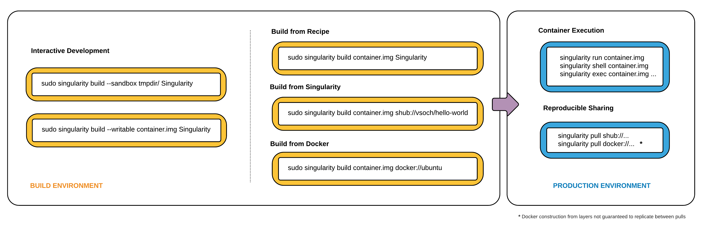

===============
Troubleshooting
===============

A little bit of help.

-----------------------
No space left on device
-----------------------

Sometimes when you are building an image, Singularity tells you that
it runs out of space on the device:

::

    sudo singularity build fatty.simg Singularity

    IOError: [Errno 28] No space left on device

    ABORT: Aborting with RETVAL=255

The issue here is that during build of a squashfs image, Singularity is
using the ``$TMPDIR`` . If your ``$TMPDIR`` is overflowing (or the mount is very small!) then
you would see this error. As a test, you can try building a sandbox. If
this is the issue, then the sandbox should work.

::

    sudo singularity build --sandbox [fatty] Singularity

**Solution**
You simply need to set the ``$SINGULARITY_CACHEDIR`` to a different location that you have more
room.

-------------------------------------
Segfault on Bootstrap of Centos Image
-------------------------------------

If you are bootstrapping a centos 6 docker image from a debian host,
you might hit a segfault:

::

    $ singularity shell docker://centos:6

    Docker image path: index.docker.io/library/centos:6

    Cache folder set to /home/jbdenis/.singularity/docker

    Creating container runtime...

    Singularity: Invoking an interactive shell within container...

    Segmentation fault

The fix is on your host, you need to pass the variable ``vsyscall=emulate`` to the kernel,
meaning in the file ``/etc/default/grub`` (note, this file is debian specific), add the
following:

::

    GRUB_CMDLINE_LINUX_DEFAULT="vsyscall=emulate"

and then update grub and reboot:

::

    update-grub && reboot

Please note that this change might have `security implications <https://git.kernel.org/pub/scm/linux/kernel/git/torvalds/linux.git/tree/Documentation/admin-guide/kernel-parameters.txt?h=v4.13-rc3#n4387>`_ that
you should be aware of. For more information, see the `original issue <https://github.com/singularityware/singularity/issues/845>`_.

------------------------------------------------------
How to use Singularity with GRSecurity enabled kernels
------------------------------------------------------

| To run Singularity on a GRSecurity enabled kernel, you must disable
  several security features:

::

    $ sudo sysctl -w kernel.grsecurity.chroot_caps=0

    $ sudo sysctl -w kernel.grsecurity.chroot_deny_mount=0

    $ sudo sysctl -w kernel.grsecurity.chroot_deny_chmod=0

    $ sudo sysctl -w kernel.grsecurity.chroot_deny_fchdir=0

------------------------------------------------
The container isn’t working on a different host!
------------------------------------------------

Singularity by default mounts your home directory. While this is great
for seamless communication between your host and the container, it can
introduce issues if you have software modules installed at ``$HOME``. For
example, we had a user `run into this issue <https://github.com/singularityware/singularity/issues/476>`_.

**Solution 1: Specify the home to mount**
A first thing to try is to point to some “sanitized home,” which is
the purpose of the -H or –home option. For example, here we are
creating a home directory under /tmp/homie, and then telling the
container to mount it as home:

::

    rm -rf /tmp/homie && mkdir -p /tmp/homie && \

    singularity exec -H /tmp/homie analysis.img /bin/bash

**Solution 2: Specify the executable to use**
It may be the issue that there is an executable in your host
environment (eg, python) that is being called in preference to the
containers. To avoid this, in your runscript (the ``%runscript`` section of the
bootstrap file) you should specify the path to the executable exactly.
This means:

::

    %runscript

    # This specifies the python in the container

    exec /usr/bin/python "$@"

    # This may pick up a different one

    exec python "$@"

This same idea would be useful if you are issuing the command to the
container using ``exec``. Thanks to `yarikoptic <https://github.com/yarikoptic>`_ for the suggestions on this
issue.

----------------------------------
Invalid Argument or Unknown Option
----------------------------------

When I try mounting my container with the ``-B`` or ``--bind`` option I receive an
unknown option or Invalid argument error.
Make sure that you are using the most recent Singularity release to
mount your container to the host system, and that the ``--bind`` argument is
placed after the execution command. An example might look like this:

::

    $ singularity run -B $PWD:/data my_container.img

Also, make sure you are using an up-to-date Singularity to bootstrap
your container. Some features (such as ``--bind`` ) will not work in earlier
versions.

-----------------------------------
Error running Singularity with sudo
-----------------------------------

This fix solves the following error when Singularity is installed into
the default compiled prefix of /usr/local:

::

    $ sudo singularity instance.start container.img daemon1

    sudo: singularity: command not found

The cause of the problem is that ``sudo`` sanitizes the PATH environment
variable and does not include /usr/local/bin in the default search
path. Considering this program path is by default owned by root, it is
reasonable to extend the default sudo PATH to include this directory.
To add /usr/local/bin to the default sudo search path, run the program
visudo which will edit the sudoers file, and search for the string
‘secure\_path’. Once found, append :/usr/local/bin to that line so it
looks like this:

::

    Defaults    secure_path = /sbin:/bin:/usr/sbin:/usr/bin:/usr/local/bin

--------------------------------------------------------
How to resolve “Too many levels of symbolic links” error
--------------------------------------------------------

Running singularity failed with “Too many levels of symbolic links”
error

::

    $ singularity run -B /apps container.img

    ERROR : There was an error binding the path /apps: Too many levels of symbolic links

    ABORT : Retval = 255
    

You got this error because /apps directory is an autofs mount point. You
can fix it by editing singularity.conf and adding the following
directive with corresponding path:

::

    autofs bug path = /apps

.. _Singularity Hub: https://singularity-hub.org/
.. _Docker Hub: https://hub.docker.com/
.. _Singularity Registry: https://www.github.com/singularityhub/sregistry
.. _reach out!: https://www.sylabs.io/contact/
.. _Reach out to us: https://www.sylabs.io/bug-report/
.. _GitHub repo: https://github.com/singularityware/singularity
.. _GitHub releases: https://github.com/singularityware/singularity/releases
.. _here: https://sci-f.github.io/tutorials
.. _this guide: https://github.com/singularityhub/singularityhub.github.io/wiki
.. _defaults.py: https://github.com/singularityware/singularity/blob/master/libexec/python/defaults.py
.. _manifest list: https://docs.docker.com/registry/spec/manifest-v2-2/#manifest-list
.. _Scientific Filesystem: https://sci-f.github.io/
.. _examples: https://github.com/singularityware/singularity/tree/master/examples
.. _Singularity source code: https://github.com/singularityware/singularity
.. _shub: http://singularity-userdoc.readthedocs.io/en/latest/#build-shub
.. _docker: http://singularity-userdoc.readthedocs.io/en/latest/#build-docker-module
.. _localimage: http://singularity-userdoc.readthedocs.io/en/latest/#build-localimage
.. _yum: http://singularity-userdoc.readthedocs.io/en/latest/#build-yum
.. _debootstrap: http://singularity-userdoc.readthedocs.io/en/latest/#build-debootstrap
.. _arch: http://singularity-userdoc.readthedocs.io/en/latest/#build-arch
.. _busybox: http://singularity-userdoc.readthedocs.io/en/latest/#build-busybox
.. _zypper: http://singularity-userdoc.readthedocs.io/en/latest/#build-zypper
.. _same conventions apply: https://linux.die.net/man/1/cp
.. _Standard Container Integration Format: https://sci-f.github.io/
.. _SCI-F Apps Home: https://sci-f.github.io/
.. _squashfs image: https://en.wikipedia.org/wiki/SquashFS
.. _singularity hub: https://github.com/singularityhub/singularityhub.github.io/wiki
.. _enabled by the system administrator: https://singularity-admindoc.readthedocs.io/en/latest/quickstart.html#user-bind-control-boolean-default-yes
.. _enabled user control of binds: https://singularity-admindoc.readthedocs.io/en/latest/quickstart.html#user-bind-control-boolean-default-yes
.. _overlay in the Singularity configuration file: https://singularity-admindoc.readthedocs.io/en/latest/quickstart.html#enable-overlay-boolean-default-no
.. _here on GitHub: https://github.com/bauerm97/instance-example
.. _here on SingularityHub: https://singularity-hub.org/collections/bauerm97/instance-example/
.. _Puppeteer: https://github.com/GoogleChrome/puppeteer
.. _tell us!: https://github.com/singularityware/singularity/issues
.. _rc1 Label Schema: http://label-schema.org/rc1/
.. _scientific filesystem: https://sci-f.github.io/
.. _cowsay container: https://github.com/singularityware/singularity/blob/development/examples/apps/Singularity.cowsay
.. _GodLoveD: https://www.github.com/GodLoveD
.. _full documentation: https://sci-f.github.io/
.. _take a look at these examples: https://asciinema.org/a/139153?speed=3
.. _Docker image folder: http://stackoverflow.com/questions/19234831/where-are-docker-images-stored-on-the-host-machine
.. _Docker Remote API: https://docs.docker.com/engine/reference/api/docker_remote_api/
.. _let us know: https://www.github.com/singularityware/singularityware.github.io/issues
.. _ldconfig: https://codeyarns.com/2014/01/14/how-to-add-library-directory-to-ldconfig-cache/
.. _ping us an issue: https://www.github.com/singularityware/singularity/issues
.. _security implications: https://git.kernel.org/pub/scm/linux/kernel/git/torvalds/linux.git/tree/Documentation/admin-guide/kernel-parameters.txt?h=v4.13-rc3#n4387
.. _original issue: https://github.com/singularityware/singularity/issues/845
.. _run into this issue: https://github.com/singularityware/singularity/issues/476
.. _yarikoptic: https://github.com/yarikoptic
.. _flags: http://singularity-userdoc.readthedocs.io/en/latest/#singularity-action-flags
.. _please let us know: https://github.com/singularityware/singularity/issues
.. _Docker: https://hub.docker.com/
.. _Singularity Hub images: https://singularity-hub.org/
.. _Singularity Hub docs: https://singularity-hub.org/faq
.. _ext3: https://en.wikipedia.org/wiki/Ext3

